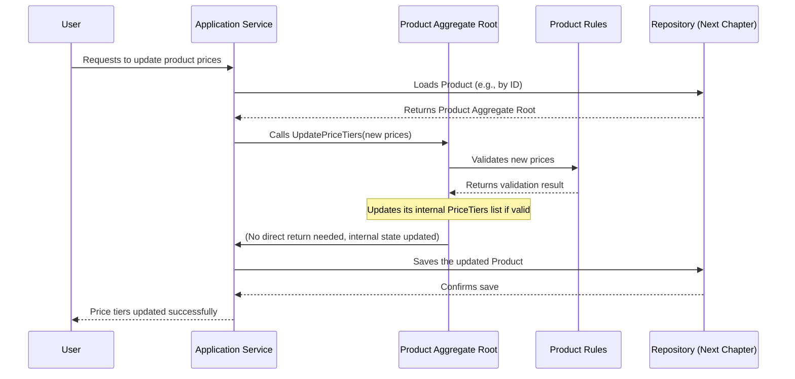

# Chapter 1: Domain Entities & Aggregate Roots

Welcome to the first chapter of our Clean Architecture tutorial! In this chapter, we'll explore two fundamental concepts that form the backbone of your application's business logic: **Domain Entities** and **Aggregate Roots**.

Imagine you're building an online store. What are the most important things in this store? Products, Customers, Orders, right? These are the core "things" (or concepts) your business deals with. Domain Entities and Aggregate Roots help us represent these "things" in our code, making sure they behave correctly according to our business rules.

## The Problem: How to Manage Core Business Concepts?

Let's think about a `Product` in our online store. A product isn't just a name and a price. It has:
*   A unique ID (like a barcode or SKU).
*   A name, description, and cost.
*   Different **price tiers** (e.g., "buy 1 for $10", "buy 5 for $8 each").
*   Information about **pre-orders** (e.g., "available in 7-10 days").

How do we group all this information together and ensure that whenever we change a product, all its related rules (like "price tiers must be positive" or "pre-order quantity cannot be negative") are always followed? This is where Domain Entities and Aggregate Roots come in handy!

## What is a Domain Entity?

Think of a **Domain Entity** like a specific person. You have a unique identity, maybe a national ID number or a student ID. Even if your hair color or clothes change, you are still the same unique person.

In software, a **Domain Entity** is an object that has:
*   **A unique identity (an ID):** This ID never changes, even if other details of the entity change over time.
*   **A lifecycle:** It's created, can be modified, and might eventually be deleted.
*   **Behavior (methods):** It contains logic related to itself. For example, a `Product` entity might have a method to `UpdatePrice` or `MarkAsPreOrder`.

Let's look at how our project defines a basic Entity:

```csharp
// File: SharedKernel/Base/Entity.cs
using Yitter.IdGenerator; // A tool to generate unique IDs

namespace SharedKernel.Base
{
    public abstract class Entity
    {
        public long Id { get; protected set; } // The unique ID for this entity

        protected Entity()
        {
            // When a new Entity is created, it automatically gets a unique ID
            Id = YitIdHelper.NextId();
        }
    }
}
```

Every `Entity` in our system, like `Product` or `User`, will inherit from this `Entity` base class. This means they automatically get a unique `Id` as soon as they are created. This `Id` is crucial for identifying and tracking them throughout the system.

## What is an Aggregate Root?

Now, let's introduce the **Aggregate Root**. Imagine you have a small team working on a project. Instead of everyone talking to every single person on the team for updates, you usually have a **team leader**. If you want to know something about the project or make a change to the team's work, you talk to the team leader. The team leader then coordinates with the rest of the team.

An **Aggregate Root** is just like that team leader! It's a special type of **Domain Entity** that acts as the main entry point to a group of related objects (other entities or smaller data structures called Value Objects). This group of objects is called an "Aggregate."

Here's why Aggregate Roots are so important:
*   **Consistency:** They make sure that all changes within their group (the aggregate) happen in a consistent way. You *always* go through the Aggregate Root to make changes, and it enforces all necessary business rules.
*   **Encapsulation:** They hide the internal structure of their group. You don't need to know all the tiny details inside; you just interact with the Aggregate Root.

In our project, `IAggregateRoot` is a simple "marker interface":

```csharp
// File: SharedKernel/Interfaces/IAggregateRoot.cs
namespace SharedKernel.Interfaces;

public interface IAggregateRoot
{ 
    // This interface doesn't have any methods.
    // It's just used to "mark" a class as an Aggregate Root.
}
```

Any `Entity` that implements `IAggregateRoot` tells us: "I am the leader of my group, and you should only interact with me to manage my related data."

### Entity vs. Value Object

You might have heard of **Value Objects**. While `Entities` have a unique identity, `Value Objects` do not. They are defined purely by their attributes (their values). Think of a `PriceTier` (e.g., "$10 for 5 items"). If another `PriceTier` also specifies "$10 for 5 items", they are considered identical. They don't have their own unique ID.

Here's a quick comparison:

| Feature           | Domain Entity             | Value Object              |
| :---------------- | :------------------------ | :------------------------ |
| **Identity**      | Has a unique ID (e.g., `Product` with ID P001) | No unique ID (e.g., a `PriceTier` of $10 for 5 items) |
| **Change**        | Can change its attributes, but still same identity | Replaced entirely if any attribute changes |
| **Purpose**       | Represents a distinct, trackable "thing" | Describes a characteristic or attribute of an Entity |
| **Example**       | `User`, `Product`, `Order` | `Address`, `Money`, `PriceTier`, `PreOrderInfo` |

In our `Product` example, `PriceTier` and `PreOrderInfo` are great candidates for Value Objects, because they describe a product's characteristics, but don't have their own independent identity in the system.

## Product as an Aggregate Root Example

Let's look at our `Product` class. Notice how it inherits from `Entity` and implements `IAggregateRoot`:

```csharp
// File: Domain/ProductModule/Entities/Product.cs (Simplified)
using SharedKernel.Base;
using SharedKernel.Interfaces;
using Domain.ProductModule.ValueObjects; // For PriceTier and PreOrderInfo

public class Product : Entity, IAggregateRoot // It's an Entity AND an Aggregate Root!
{
    // Basic product info
    public string Code { get; private set; } = string.Empty;
    public string Name { get; private set; } = string.Empty;
    public decimal? CostPrice { get; private set; }

    // These are Value Objects, part of the Product aggregate
    public List<PriceTier> PriceTiers { get; private set; } = new List<PriceTier>();
    public PreOrderInfo PreOrderInfo { get; private set; } = new PreOrderInfo("From 7 to 10 days", 0);

    // Constructor to create a new Product
    public Product(string code, string name, decimal? costPrice, ...)
    {
        Code = code;
        Name = name;
        CostPrice = costPrice;
        // ... set other initial properties
    }

    // Method to update price tiers - this enforces rules!
    public void UpdatePriceTiers(int updateBy, List<PriceTier> values)
    {
        // Business rule: Ensure price tiers are valid (e.g., positive prices)
        // ProductRules.EnsureValidPriceTiers(values); 

        PriceTiers = values; // Update the internal Value Objects
        // this.MarkUpdated(updateBy); // (From a later chapter: Auditing)
    }

    // Other methods that encapsulate business logic
    public void MarkAsPreOrder(int updateBy, PreOrderInfo preOrderInfo) { /* ... */ }
    public void ClearPreOrder(int updateBy) { /* ... */ }
}
```

Notice a few things:
*   `Product` holds `PriceTiers` and `PreOrderInfo` internally.
*   To change `PriceTiers`, you *must* call `Product.UpdatePriceTiers()`. You cannot directly change `Product.PriceTiers` from outside. This ensures that any business rules related to price tiers are always checked and enforced by the `Product` Aggregate Root itself.

## How to Use Entities and Aggregate Roots

Let's walk through our use case: **Create a new `Product` and then update its price tiers.**

### Step 1: Creating a Product

When we want a new product, we create a new `Product` instance using its constructor.

```csharp
// Imagine this code is in a "service" that handles product operations
using Domain.ProductModule.Entities;

// Create a new Laptop product
Product laptop = new Product(
    code: "LT001",
    name: "Powerful Laptop",
    costPrice: 1000m,
    unitOfQuantityId: 1, // Example: 'piece'
    categoryId: 1 // Example: 'Electronics'
);

// After this, 'laptop' now exists in memory and has a unique Id!
// Example: laptop.Id might be 657845321098765432
```

In the background, when `new Product(...)` is called, our `Entity` base class automatically generates a unique `Id` for this `laptop` instance. This `laptop` object is now a fully-formed `Product` Aggregate Root, ready to manage its own details.

### Step 2: Updating Product Price Tiers

Now, let's say we want to add specific price tiers for this laptop. We call a method directly on the `laptop` object:

```csharp
using System.Collections.Generic; // For List
using Domain.ProductModule.ValueObjects; // For PriceTier

// Update the laptop's price tiers
laptop.UpdatePriceTiers(
    updateBy: 1, // Assume user ID 1 is performing the update
    values: new List<PriceTier>
    {
        new PriceTier(price: 1200m, quantity: 1),  // $1200 for 1
        new PriceTier(price: 1100m, quantity: 5)   // $1100 for 5 or more
    }
);

// What happens next?
// 1. The 'laptop' (Product Aggregate Root) receives the request.
// 2. It internally uses 'ProductRules.EnsureValidPriceTiers' (a rule checker)
//    to make sure the new prices and quantities make sense (e.g., not negative).
// 3. If rules pass, it updates its internal 'PriceTiers' list.
// 4. If rules fail, it throws an error.
```

By calling `laptop.UpdatePriceTiers()`, we are using the `Product` Aggregate Root as the single point of entry to modify its internal `PriceTiers`. This ensures that all business rules related to `PriceTier` are enforced right here, within the `Product` itself.

## How It Works Under the Hood

Let's briefly look at the flow when you interact with an Aggregate Root like `Product`.



1.  **User Request:** A user wants to change a product's price tiers.
2.  **Application Service:** An "Application Service" (we'll cover these more in [Clean Architecture Layers](03_clean_architecture_layers_.md)) receives this request. It's like the cashier in a store, handling your request.
3.  **Load Aggregate Root:** The Application Service asks a "Repository" (explained in [Repository Pattern (IRepository<T>)](04_repository_pattern__irepository_t___.md)) to find the specific `Product` (our Aggregate Root) by its ID from the database.
4.  **Execute Business Logic:** Once the `Product` Aggregate Root is loaded into memory, the Application Service calls a method on it, like `UpdatePriceTiers`.
5.  **Enforce Rules:** Inside the `UpdatePriceTiers` method, the `Product` itself contains and enforces its own business rules (e.g., by calling `ProductRules.EnsureValidPriceTiers`). It updates its internal `PriceTiers` list.
6.  **Save Changes:** Finally, the Application Service tells the Repository to save the `Product` Aggregate Root back to the database. The Repository ensures that all the changes within the aggregate (including `PriceTiers` and `PreOrderInfo` if they were changed) are saved together.

This process ensures that no one can update the `PriceTiers` of a `Product` without going through the `Product` Aggregate Root, guaranteeing that all business rules are always applied.

## Conclusion

In this chapter, we've learned about **Domain Entities** as objects with unique identities that represent core business concepts, and **Aggregate Roots** as special Entities that act as leaders for a group of related objects, enforcing consistency and encapsulating business rules. We saw how `Product` serves as an Aggregate Root, managing its own `PriceTier` and `PreOrderInfo` Value Objects.

By using Entities and Aggregate Roots, we create a robust and maintainable domain model where business logic is clear, encapsulated, and consistently enforced.

In the [next chapter](02_auditing___soft_deletion_.md), we will build upon this foundation by exploring how to implement common features like Auditing and Soft Deletion directly on our Domain Entities.

---