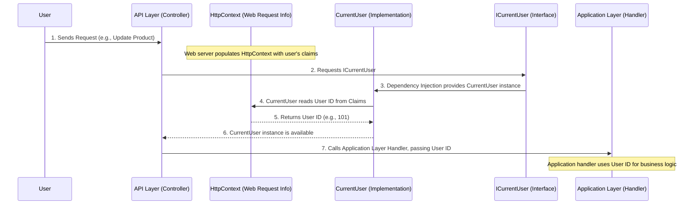

# Chapter 5: Current User Context (ICurrentUser)

Welcome back! In [Chapter 4: Repository Pattern (IRepository<T>)](04_repository_pattern__irepository_t___.md), we learned how to separate our business logic from the messy details of data storage. We saw how our `Application` layer can create and save a `Product` without knowing if it's going into a SQL database or a NoSQL one.

But what if we need to know *who* is performing these actions? In [Chapter 2: Auditing & Soft Deletion](02_auditing___soft_deletion_.md), we introduced `CreatedBy` and `UpdatedBy` fields on our entities to track who made changes. How do we get the ID of the current user so we can record it? This is where the **Current User Context** comes in, using the `ICurrentUser` interface.

## The Problem: Knowing "Who" is Doing What

Imagine you have a secure office building. When someone walks in, you need to know who they are to grant them access or log their activity. You don't want every department in the building to have its own complex system for checking IDs, talking to the security guard, or deciphering entry logs. That would be messy and error-prone.

In our application, when a user logs in and performs an action (like creating a new product, updating a price, or deleting an old order), many parts of our system might need to know:
*   What is this user's unique ID?
*   What is their username?
*   Are they even logged in (authenticated)?

If every part of the application had to dig into the technical details of web requests (like checking "cookies" or "security tokens") to find this information, our code would become complicated and tied to web technology. We need a simpler, cleaner way to get this "identity card" information for the current user.

## The Solution: The `ICurrentUser` Interface

The `ICurrentUser` interface provides a clean, unified way to get information about the person (or system) currently interacting with our application. It's like having a designated "identity card scanner" at the entrance of our application: any part of the system can query it to know who is currently logged in, without needing to understand how the identity was verified.

### The `ICurrentUser` Contract

First, let's look at the simple contract (interface) for `ICurrentUser`:

```csharp
// File: SharedKernel/Interfaces/IUserCurrent.cs
namespace SharedKernel.Interfaces;

public interface ICurrentUser
{
    int? UserId { get; }      // The unique ID of the current user (can be null if not logged in)
    string? Username { get; } // The username of the current user
    bool IsAuthenticated { get; } // Is the user logged in?
}
```

**Explanation:**
*   This interface lives in the `SharedKernel` layer. This is crucial because `SharedKernel` is the innermost, most independent layer, meaning `Domain`, `Application`, and `Infrastructure` layers can all safely depend on it without creating circular dependencies.
*   It defines three simple properties: `UserId`, `Username`, and `IsAuthenticated`. These are all the details our business logic typically needs about the current user.
*   The `int?` for `UserId` means it can be an integer, or `null` if no user is logged in.

## How to Use `ICurrentUser`

Now, let's see how our `Application` and `API` layers can use this `ICurrentUser` interface to get user information without getting bogged down in web details.

### Using `ICurrentUser` in the `Application` Layer (for Auditing)

Recall from [Chapter 2: Auditing & Soft Deletion](02_auditing___soft_deletion_.md) that our entities have `CreatedBy` and `UpdatedBy` fields. When we create a new `Product`, we need to know *who* created it. The `ICurrentUser` makes this very easy:

```csharp
// File: Application/UseCases/ProductModule/Commands/CreateProduct/CreateProductHandler.cs (Simplified)
using Domain.ProductModule.Entities;
using MediatR;
using SharedKernel.Interfaces; // For ICurrentUser and IRepository

namespace Application.UseCases.ProductModule.Commands.CreateProduct;

public class CreateProductHandler : IRequestHandler<CreateProductCommand, long>
{
    private readonly IRepository<Product> _productRepository;
    private readonly ICurrentUser _currentUser; // We "ask" for ICurrentUser here!

    public CreateProductHandler(
        ICurrentUser currentUser, // Dependency Injection provides it
        IRepository<Product> productRepository
    )
    {
        _currentUser = currentUser;
        _productRepository = productRepository;
    }

    public async Task<long> Handle(CreateProductCommand request, CancellationToken cancellationToken)
    {
        // Get the current user's ID
        // For testing, we use 0 if UserId is not available.
        int userId = _currentUser.UserId ?? 0;

        var product = new Product(request.Code, request.Name, request.CostPrice, /* ... */);

        if (request.PriceTiers.Count > 0)
        {
            product.UpdatePriceTiers(userId, request.PriceTiers); // Pass the user ID!
        }

        // Add the product. Behind the scenes, the Entity's constructor
        // or a default behavior would set CreatedBy using this userId.
        await _productRepository.AddAsync(product, cancellationToken);
        return product.Id;
    }
}
```

**Explanation:**
*   The `CreateProductHandler` (in the `Application` layer) needs the `userId` to pass to the `Product` entity's methods (like `UpdatePriceTiers`).
*   Instead of trying to find the user ID from a complex web request, it simply receives an `ICurrentUser` object in its constructor (thanks to Dependency Injection, which we'll see soon).
*   Then, it just accesses `_currentUser.UserId`. This is a clean, technology-independent way to get the user's ID.

### Using `ICurrentUser` in the `API` Layer (for Authorization)

The `API` layer often needs to know the user's ID to perform actions like soft-deleting entities. Our base controller for delete/recovery operations also uses `ICurrentUser`:

```csharp
// File: API/Controller/BaseApi/DeleteAndRecoveryController.cs (Simplified)
using SharedKernel.Interfaces;
using MediatR;
using Microsoft.AspNetCore.Mvc;

namespace API.Controllers.BaseApi;

public abstract class BaseDeleteAndRecoveryController<TSoftDelete, THardDelete, TRecovery> : ControllerBase
{
    private readonly ISender _mediator;
    private readonly ICurrentUser _currentUser; // We "ask" for ICurrentUser here!

    protected BaseDeleteAndRecoveryController(ISender mediator, ICurrentUser currentUser)
    {
        _mediator = mediator;
        _currentUser = currentUser;
    }

    [HttpDelete("soft-delete")]
    public async Task<IActionResult> SoftDeleteAsync([FromBody] List<long> ids)
    {
        // Get the user ID from ICurrentUser
        int userId = _currentUser.UserId ?? 1; // Default to 1 for example

        // Create a command (a request for the Application layer)
        // and include the userId
        var command = CreateSoftDeleteCommand(ids, userId);

        // Send the command to the Application layer
        var result = await _mediator.Send(command);
        return Ok(result);
    }
    // ... other methods like HardDeleteAsync, RecoveryAsync
}
```

**Explanation:**
*   The `BaseDeleteAndRecoveryController` (in the `API` layer) receives `ICurrentUser` in its constructor.
*   Before sending a soft-delete command, it gets the `userId` from `_currentUser.UserId` and includes it in the `command` object sent to the `Application` layer. This ensures the correct `DeletedBy` information is recorded.

## How It Works Under the Hood

So, how does `ICurrentUser` actually get the `UserId`, `Username`, and `IsAuthenticated` values? It does this by reading information from the current web request's **security claims**.

### 1. The `CurrentUser` Implementation

The actual code that reads these details is called `CurrentUser`. It's a concrete class that implements the `ICurrentUser` interface. Since it deals with web-specific details (`HttpContext`), it lives in the `Infrastructure` layer, keeping those technical details isolated.

```csharp
// File: Infrastructure/Services/CurrentUser.cs
using SharedKernel.Interfaces;
using System.Security.Claims; // For working with user claims
using Microsoft.AspNetCore.Http; // For HttpContextAccessor

namespace Infrastructure.Services;

public class CurrentUser : ICurrentUser // This class implements the interface!
{
    private readonly IHttpContextAccessor _httpContextAccessor; // Tool to access web request info

    public CurrentUser(IHttpContextAccessor httpContextAccessor)
    {
        _httpContextAccessor = httpContextAccessor;
    }

    public int? UserId
    {
        get
        {
            // Try to find the user ID claim (e.g., from a JWT token)
            var userIdClaim = _httpContextAccessor.HttpContext?.User?.FindFirst(ClaimTypes.NameIdentifier);
            // If found and it's a number, convert it to int, otherwise null
            return userIdClaim != null && int.TryParse(userIdClaim.Value, out var id) ? id : null;
        }
    }

    public string? Username => _httpContextAccessor.HttpContext?.User?.Identity?.Name;

    public bool IsAuthenticated => _httpContextAccessor.HttpContext?.User?.Identity?.IsAuthenticated ?? false;
}
```

**Explanation:**
*   `_httpContextAccessor`: This is a special tool provided by ASP.NET Core that allows us to safely access the details of the current web request (`HttpContext`).
*   `ClaimTypes.NameIdentifier`: When a user logs in (e.g., with a username and password, or through a social media account), the authentication system creates a "security token" (like a JWT). This token contains "claims" – pieces of information about the user. `ClaimTypes.NameIdentifier` is a standard way to store the user's unique ID in these claims.
*   The `UserId` property attempts to find this claim and convert its value to an integer. If the user isn't logged in, or the claim isn't found, it returns `null`.
*   Similarly, `Username` and `IsAuthenticated` read other standard properties from the user's identity.

### The Flow: From Web Request to `UserId`

Let's visualize how the `UserId` flows from a web request to our `Application` layer handler:



1.  **User Sends Request:** A user sends a web request (e.g., to soft-delete a product).
2.  **Web Server & HttpContext:** Before our application code even runs, the web server (ASP.NET Core) processes the incoming request. If the user is logged in (e.g., with a JWT token), it extracts information from that token and populates the `HttpContext` with the user's "claims" (their identity card details).
3.  **API Layer Requests `ICurrentUser`:** Our `BaseDeleteAndRecoveryController` (in the `API` layer) needs the current `userId`. It asks for an `ICurrentUser` object in its constructor.
4.  **Dependency Injection:** At this point, Dependency Injection (configured in the `Infrastructure` layer) steps in. It sees the request for `ICurrentUser` and knows that it should provide an instance of `CurrentUser` (the implementation).
5.  **`CurrentUser` Reads from `HttpContext`:** The `CurrentUser` instance then uses `_httpContextAccessor` to reach into the `HttpContext` and pull out the `UserId` from the security claims.
6.  **`UserId` Available:** The `CurrentUser` object now holds the correct `UserId` (e.g., 101).
7.  **Passing `UserId` to Application:** The `API` layer's controller can then simply call `_currentUser.UserId` and pass this `userId` into the command that goes to the `Application` layer. The `Application` layer handler then uses this `userId` to perform actions like setting the `DeletedBy` field on an entity.

### Connecting the Pieces: Dependency Injection (Again!)

Just like with the `IRepository<T>` in [Chapter 4](04_repository_pattern__irepository_t___.md), we need to tell our application how to provide a `CurrentUser` object whenever an `ICurrentUser` is requested. This setup is done in the `Infrastructure` layer:

```csharp
// File: Infrastructure/DependencyInjection/DependencyInjection.cs (Simplified)
using Microsoft.Extensions.DependencyInjection; // For DI
using Infrastructure.Services; // For CurrentUser
using SharedKernel.Interfaces; // For ICurrentUser

namespace Infrastructure.DependencyInjection;

public static class DependencyInjection
{
    public static IServiceCollection AddInfrastructure(this IServiceCollection services, string connectionString)
    {
        // ... (existing AppDbContext and IRepository registrations)

        // Register ICurrentUser: When someone asks for ICurrentUser,
        // give them an instance of CurrentUser
        services.AddScoped<ICurrentUser, CurrentUser>();
        services.AddHttpContextAccessor(); // Needed for CurrentUser to access HttpContext

        return services;
    }
}
```

**Explanation:**
*   `services.AddScoped<ICurrentUser, CurrentUser>();`: This line is the magic! It tells the Dependency Injection system: "Whenever any part of the application asks for an object that implements `ICurrentUser`, create and provide an instance of the `CurrentUser` class."
*   `services.AddHttpContextAccessor();`: This line is necessary because `CurrentUser` needs `IHttpContextAccessor` to do its job. We need to register this special service so that Dependency Injection can provide it to `CurrentUser`'s constructor.

This setup ensures that `ICurrentUser` can be painlessly injected into any constructor that needs it, whether it's in the `API` layer, `Application` layer, or even a `Domain` service (though less common for direct `ICurrentUser` use in `Domain`).

## Conclusion

In this chapter, we've explored the **Current User Context** using the `ICurrentUser` interface. We saw how it provides a clean, decoupled way to access information about the currently logged-in user, which is vital for features like [Auditing & Soft Deletion](02_auditing___soft_deletion_.md). By defining `ICurrentUser` in the `SharedKernel` and implementing `CurrentUser` in the `Infrastructure` layer, we maintain a strong separation of concerns, keeping our core business logic free from web-specific details.

Now that we understand how to get the current user's context, we're ready to dive into how our application handles commands and queries: [MediatR (CQRS Commands & Handlers)](06_mediatr__cqrs_commands___handlers__.md).

---
