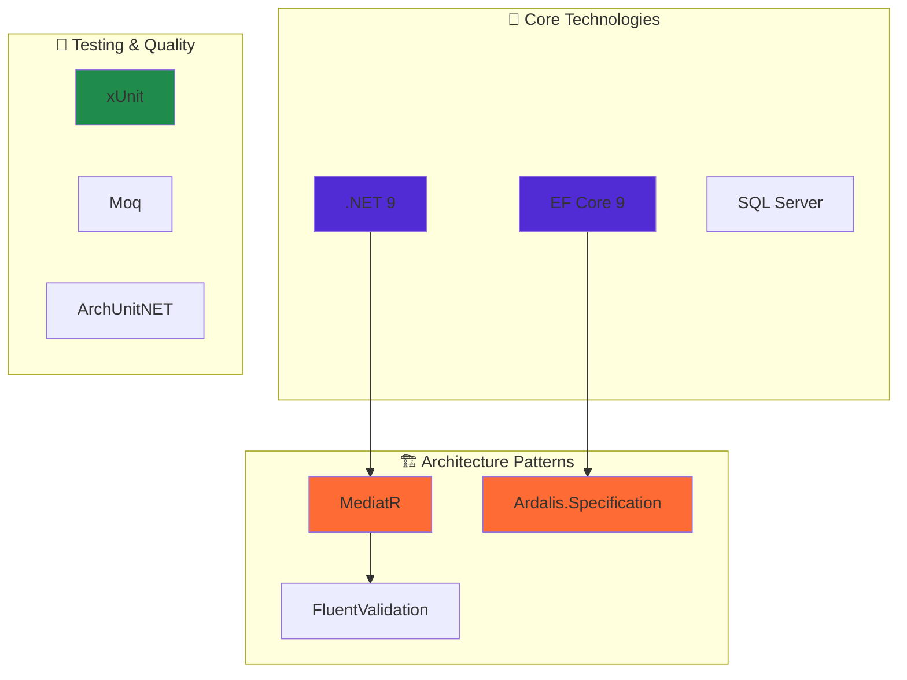
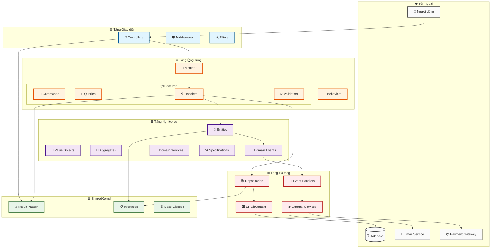
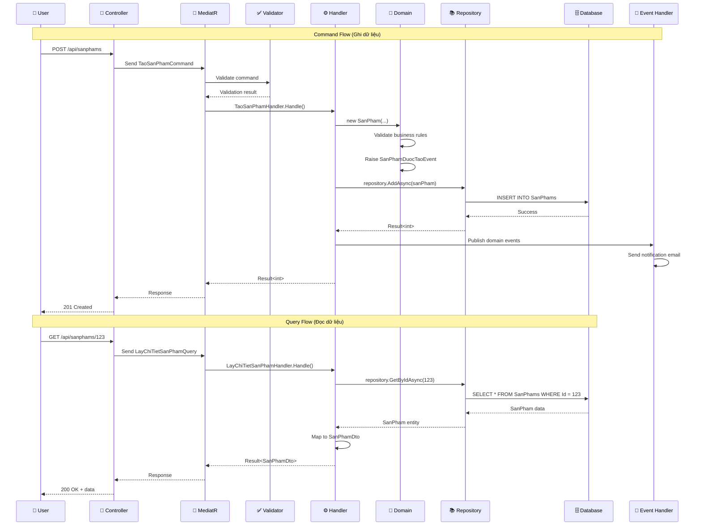
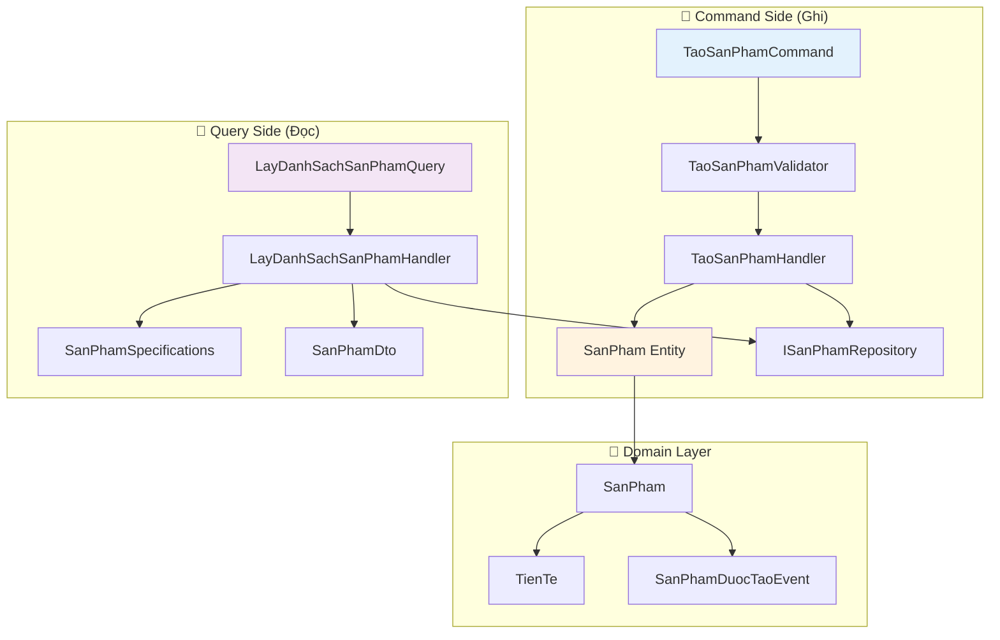
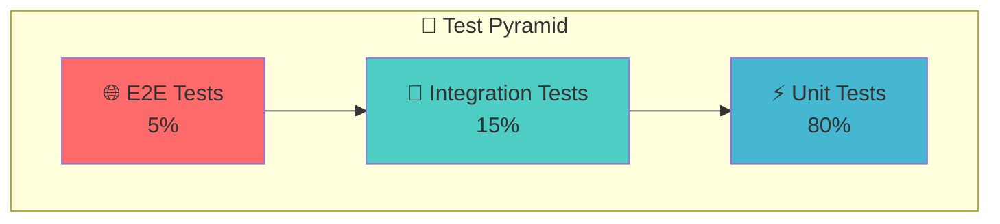

# 🏗️ Hướng dẫn Clean Architecture với .NET 9
## Kết hợp DDD, CQRS, Specification Pattern và Features-based Organization

> **Tài liệu hướng dẫn toàn diện** về việc xây dựng ứng dụng .NET hiện đại với kiến trúc sạch và các pattern tiên tiến nhất.

---

## 📋 Mục lục

1. [🎯 Tổng quan kiến trúc](#-tổng-quan-kiến-trúc)
2. [🗂️ Cấu trúc dự án tối ưu](#️-cấu-trúc-dự-án-tối-ưu)
3. [🔄 Luồng dữ liệu và phụ thuộc](#-luồng-dữ-liệu-và-phụ-thuộc)
4. [🧠 Phân tích chi tiết từng tầng](#-phân-tích-chi-tiết-từng-tầng)
5. [🎨 Features-based Organization](#-features-based-organization)
6. [🔧 Cài đặt và cấu hình](#-cài-đặt-và-cấu-hình)
7. [🧪 Chiến lược kiểm thử](#-chiến-lược-kiểm-thử)
8. [📐 Nguyên tắc thiết kế](#-nguyên-tắc-thiết-kế)
9. [🚀 Triển khai production](#-triển-khai-production)
10. [💡 Best practices](#-best-practices)

---

## 🎯 Tổng quan kiến trúc

### 🌟 Triết lý thiết kế

Dự án **HaiphongTech** được xây dựng dựa trên **5 nguyên tắc cốt lõi**:

| Nguyên tắc | Mô tả | Lợi ích |
|------------|-------|---------|
| **🎯 Domain-Centric** | Nghiệp vụ là trung tâm, công nghệ phục vụ nghiệp vụ | Dễ hiểu, bảo trì, mở rộng |
| **🔄 CQRS** | Tách biệt hoàn toàn Command (ghi) và Query (đọc) | Tối ưu hiệu năng, scalability |
| **🎨 Feature-based** | Tổ chức theo tính năng, không theo layer | Phát triển song song, dễ quản lý |
| **🔍 Specification-driven** | Logic truy vấn tái sử dụng và kết hợp | Code sạch, linh hoạt |
| **🛡️ Type-safe** | Xử lý lỗi rõ ràng với Result Pattern | Ít bug, dễ debug |

### 🛠️ Công nghệ sử dụng



---

## 🗂️ Cấu trúc dự án tối ưu

### 📁 Solution Structure - 5 Projects theo Clean Architecture

Dự án được chia thành **5 projects chính** theo nguyên tắc Clean Architecture:

| Project | Vai trò | Phụ thuộc |
|---------|---------|-----------|
| **� SharedKernel** | Common abstractions, base classes | Không có |
| **🟧 Domain** | Business logic, entities, rules | SharedKernel |
| **🟨 Application** | Use cases, CQRS handlers | Domain, SharedKernel |
| **🟥 Infrastructure** | Data access, external services | Application, Domain, SharedKernel |
| **🟦 API** | REST endpoints, controllers | Application, SharedKernel |

### 📁 Cây thư mục tổng quan

```
HaiphongTech.sln                   # Solution file chính
│
├── src/                          # Thư mục chứa mã nguồn
│   
│   ├── HaiphongTech.API/         # 🟦 Presentation Layer (Web API)
│   │   ├── Controllers/          # Định nghĩa các endpoint REST
│   │   │   └── ProductsController.cs
│   │   ├── Middlewares/          # Xử lý lỗi, xác thực, logging
│   │   │   └── ErrorHandlingMiddleware.cs
│   │   ├── Filters/              # Action/Exception filters
│   │   │   └── ValidationFilter.cs
│   │   ├── Extensions/           # Đăng ký dịch vụ, Swagger
│   │   │   └── ServiceCollectionExtensions.cs
│   │   └── Program.cs            # Điểm khởi động ứng dụng
│   │
│   ├── HaiphongTech.Application/ # 🟨 Application Layer (CQRS)
│   │   ├── Behaviors/            # Pipeline behaviors MediatR
│   │   │   └── ValidationBehavior.cs
│   │   ├── Features/             # Chia theo tính năng (feature)
│   │   │   └── Products/
│   │   │       ├── Commands/     # Lệnh ghi dữ liệu
│   │   │       │   └── CreateProduct/
│   │   │       │       ├── CreateProductCommand.cs
│   │   │       │       ├── CreateProductHandler.cs
│   │   │       │       └── CreateProductValidator.cs
│   │   │       ├── Queries/      # Truy vấn đọc dữ liệu
│   │   │       │   └── GetProductById/
│   │   │       │       ├── GetProductByIdQuery.cs
│   │   │       │       ├── GetProductByIdHandler.cs
│   │   │       │       └── GetProductByIdValidator.cs
│   │   │       ├── DTOs/         # Đối tượng truyền dữ liệu giữa các tầng
│   │   │       │   └── ProductDto.cs
│   │   │       └── Mappings/     # AutoMapper profiles
│   │   │           └── ProductProfile.cs
│   │   └── Common/               # Các lớp chung trong Application
│   │       └── Exceptions/
│   │           └── ValidationException.cs
│   │
│   ├── HaiphongTech.Domain/      # 🟧 Domain Layer (Business Logic)
│   │   ├── Entities/             # Các thực thể chính
│   │   │   └── Product.cs
│   │   ├── Aggregates/           # Aggregate roots
│   │   │   └── OrderAggregate.cs
│   │   ├── ValueObjects/         # Kiểu giá trị bất biến
│   │   │   └── Money.cs
│   │   ├── Events/               # Domain events
│   │   │   └── ProductCreatedEvent.cs
│   │   ├── Repositories/         # Interface repository
│   │   │   └── IProductRepository.cs
│   │   └── Specifications/       # Business-rule specifications
│   │       ├── ProductIsActiveSpecification.cs
│   │       └── ProductPriceBetweenSpecification.cs
│   │
│   ├── HaiphongTech.Infrastructure/ # 🟥 Infrastructure Layer
│   │   ├── Persistence/          # Cơ chế lưu trữ dữ liệu
│   │   │   ├── DbContexts/       # DbContext EF Core
│   │   │   │   └── ApplicationDbContext.cs
│   │   │   ├── Repositories/     # Triển khai Repository
│   │   │   │   └── ProductRepository.cs
│   │   │   └── Migrations/       # Migrations EF Core
│   │   ├── External/             # Service ngoài (Mail, Payment)
│   │   │   └── EmailService.cs
│   │   └── Messaging/            # Xử lý DomainEvents qua EventBus
│   │       └── DomainEventsHandler.cs
│   │
│   └── HaiphongTech.SharedKernel/ # 🟪 Shared Kernel (Chung)
│       ├── Abstractions/         # Interface chung
│       │   └── ISpecification.cs
│       ├── Results/              # Result<T> pattern
│       │   └── Result.cs
│       ├── Exceptions/           # Exception chung
│       │   └── BusinessException.cs
│       └── Utilities/            # Các tiện ích tĩnh
│           └── Guard.cs
│
├── tests/                        # 🧪 Thư mục kiểm thử
│   ├── HaiphongTech.Domain.Tests/          # Unit test Domain
│   │   └── ProductIsActiveSpecificationTests.cs
│   ├── HaiphongTech.Application.Tests/     # Test Handlers, Behaviors
│   ├── HaiphongTech.Infrastructure.Tests/  # Test Repository với InMemoryDb
│   └── HaiphongTech.API.Tests/             # Integration tests API
│
├── build/                        # CI/CD, Docker, Scripts
│   ├── Docker/
│   │   └── docker-compose.yml
│   ├── GitHubActions/
│   │   └── ci.yml
│   └── Scripts/
│       └── init-clean-arch.ps1
│
└── docs/                         # 📄 Tài liệu, ADRs, API specs
    ├── architecture.md
    └── decisions/
```

### 🎯 Nguyên tắc tổ chức tối ưu

| Nguyên tắc | Mô tả | Lợi ích |
|------------|-------|---------|
| **📦 Feature-based** | Mỗi feature là module độc lập | Phát triển song song, dễ maintain |
| **🔄 CQRS** | Tách biệt Commands và Queries | Tối ưu hiệu năng, scalability |
| **🎯 Single Responsibility** | Mỗi class có một trách nhiệm | Code sạch, dễ test |
| **🔍 Specification** | Logic truy vấn tái sử dụng | Linh hoạt, maintainable |
| **🛡️ Type Safety** | Sử dụng Result Pattern | Ít bug, error handling rõ ràng |
| **🌐 Tiếng Việt** | Tên class/method bằng tiếng Việt | Dễ hiểu cho team Việt Nam |

---

## 🔄 Luồng dữ liệu và phụ thuộc

### 🏗️ Sơ đồ kiến trúc tổng thể



### 📋 Ma trận phụ thuộc chi tiết

| Tầng | Được phép sử dụng | **KHÔNG** được sử dụng | Lý do |
|------|-------------------|-------------------------|-------|
| **🟦 API** | Application, SharedKernel | Domain, Infrastructure | Tách biệt concerns, dễ test |
| **🟨 Application** | Domain, SharedKernel | Infrastructure, API | Business logic độc lập |
| **🟧 Domain** | SharedKernel | Tất cả tầng khác | Trung tâm, không phụ thuộc |
| **🟥 Infrastructure** | Application, Domain, SharedKernel | API | Implement contracts |
| **🟪 SharedKernel** | Không có | Tất cả tầng khác | Foundation layer |

### 🔄 Luồng xử lý CQRS điển hình



### 🎯 Lợi ích của kiến trúc này

| Lợi ích | Mô tả | Ví dụ thực tế |
|---------|-------|---------------|
| **🧪 Testability** | Dễ dàng unit test từng tầng | Mock IRepository để test Handler |
| **🔄 Flexibility** | Thay đổi implementation không ảnh hưởng business | Đổi từ SQL Server sang PostgreSQL |
| **📈 Scalability** | Mở rộng theo feature, không theo layer | Thêm module KhuyenMai độc lập |
| **👥 Team Work** | Nhiều dev làm song song | Dev A làm SanPhams, Dev B làm DonHangs |
| **🛡️ Maintainability** | Code sạch, dễ bảo trì | Thay đổi business rule chỉ ở Domain |
| **🔍 Debuggability** | Dễ trace lỗi theo luồng | Request → Handler → Domain → Repository |

---

## 🎨 Features-based Organization

### 🌟 Triết lý tổ chức theo tính năng

Thay vì tổ chức theo **tầng kỹ thuật** (Controllers, Services, Repositories), chúng ta tổ chức theo **tính năng nghiệp vụ** (SanPhams, DonHangs, KhachHangs...).

### 📊 So sánh cách tổ chức

| Cách tổ chức | Ưu điểm | Nhược điểm |
|--------------|---------|------------|
| **Layer-based** | Dễ hiểu cho người mới | Khó maintain, coupling cao |
| **Feature-based** | Cohesion cao, dễ mở rộng | Cần hiểu rõ domain |

### 📁 Cấu trúc Feature điển hình - Module SanPhams

```
Features/SanPhams/                       # 🛍️ Module Sản phẩm
├── Commands/                            # 📝 Các lệnh thay đổi dữ liệu
│   ├── TaoSanPham/                     # ➕ Tạo sản phẩm mới
│   │   ├── TaoSanPhamCommand.cs        # Request model
│   │   ├── TaoSanPhamHandler.cs        # Business logic
│   │   └── TaoSanPhamValidator.cs      # Validation rules
│   ├── CapNhatSanPham/                 # ✏️ Cập nhật sản phẩm
│   │   ├── CapNhatSanPhamCommand.cs
│   │   ├── CapNhatSanPhamHandler.cs
│   │   └── CapNhatSanPhamValidator.cs
│   └── XoaSanPham/                     # 🗑️ Xóa sản phẩm
│       ├── XoaSanPhamCommand.cs
│       ├── XoaSanPhamHandler.cs
│       └── XoaSanPhamValidator.cs
│
├── Queries/                            # 📖 Các truy vấn đọc dữ liệu
│   ├── LayDanhSachSanPham/            # 📋 Lấy danh sách
│   │   ├── LayDanhSachSanPhamQuery.cs
│   │   └── LayDanhSachSanPhamHandler.cs
│   ├── LayChiTietSanPham/             # 🔍 Lấy chi tiết
│   │   ├── LayChiTietSanPhamQuery.cs
│   │   └── LayChiTietSanPhamHandler.cs
│   └── TimKiemSanPham/                # 🔎 Tìm kiếm
│       ├── TimKiemSanPhamQuery.cs
│       └── TimKiemSanPhamHandler.cs
│
├── DTOs/                              # 📋 Data Transfer Objects
│   ├── SanPhamDto.cs                  # DTO cơ bản
│   ├── TaoSanPhamDto.cs              # DTO cho tạo mới
│   ├── CapNhatSanPhamDto.cs          # DTO cho cập nhật
│   └── DanhSachSanPhamDto.cs         # DTO cho danh sách
│
├── Validators/                        # ✅ Validation rules
│   ├── TaoSanPhamValidator.cs
│   ├── CapNhatSanPhamValidator.cs
│   └── SanPhamDtoValidator.cs
│
└── Specifications/                    # 🔍 Query specifications
    ├── SanPhamTheoTrangThaiSpec.cs   # Lọc theo trạng thái
    ├── SanPhamTheoGiaSpec.cs         # Lọc theo giá
    └── SanPhamTheoLoaiSpec.cs        # Lọc theo loại
```

### 🔄 Luồng CQRS trong Feature



### 🎯 Lợi ích của Features-based

| Lợi ích | Mô tả | Ví dụ |
|---------|-------|-------|
| **🎯 High Cohesion** | Code liên quan gần nhau | Tất cả logic SanPham ở một chỗ |
| **🔄 Low Coupling** | Features độc lập với nhau | Thay đổi SanPham không ảnh hưởng DonHang |
| **👥 Team Scalability** | Nhiều team làm song song | Team A: SanPham, Team B: DonHang |
| **🧪 Easy Testing** | Test theo feature | Test toàn bộ SanPham workflow |
| **📈 Business Alignment** | Cấu trúc code = cấu trúc nghiệp vụ | PM dễ hiểu và review |

### 🛠️ Quy tắc đặt tên tiếng Việt

| Thành phần | Quy tắc | Ví dụ |
|------------|---------|-------|
| **Commands** | `[Động từ][Đối tượng]Command` | `TaoSanPhamCommand` |
| **Queries** | `[Động từ][Đối tượng]Query` | `LayDanhSachSanPhamQuery` |
| **Handlers** | `[Tên Command/Query]Handler` | `TaoSanPhamHandler` |
| **DTOs** | `[Đối tượng]Dto` | `SanPhamDto` |
| **Validators** | `[Tên Command]Validator` | `TaoSanPhamValidator` |
| **Specifications** | `[Đối tượng][Điều kiện]Spec` | `SanPhamTheoGiaSpec` |

---

## 🧠 Phân tích chi tiết từng tầng

### 1. 🟪 SharedKernel - Nền tảng chung

**🎯 Vai trò:** Cung cấp các **building blocks** và **abstractions** dùng chung cho toàn bộ hệ thống.

#### 📁 Cấu trúc thư mục chi tiết

```
SharedKernel/
├── 📋 Interfaces/                 # Giao diện chung
│   ├── IAggregateRoot.cs          # Đánh dấu aggregate root
│   ├── IRepository.cs             # Repository pattern base
│   ├── IUnitOfWork.cs             # Unit of Work pattern
│   └── IDomainEvent.cs            # Domain event interface
├── 🎯 Results/                    # Result pattern implementation
│   ├── Result.cs                  # Generic result wrapper
│   ├── Error.cs                   # Error representation
│   ├── ValidationResult.cs        # Validation specific result
│   └── PagedResult.cs             # Paged data result
├── 📢 Events/                     # Base domain events
│   ├── BaseDomainEvent.cs         # Base class cho domain events
│   └── IEventHandler.cs           # Event handler interface
├── 🔍 Specifications/             # Specification pattern base
│   ├── BaseSpecification.cs       # Base specification class
│   └── ISpecification.cs          # Specification interface
├── 🚫 Exceptions/                 # Common exceptions
│   ├── DomainException.cs         # Domain rule violations
│   ├── ValidationException.cs     # Validation errors
│   ├── NotFoundException.cs       # Entity not found
│   └── BusinessRuleException.cs   # Business rule violations
└── 🛠️ Extensions/                 # Extension methods
    ├── StringExtensions.cs        # String utilities
    ├── DateTimeExtensions.cs      # DateTime utilities
    └── EnumExtensions.cs          # Enum utilities
```

#### 🎯 Result Pattern - Xử lý lỗi type-safe

```csharp
// Results/Result.cs
namespace HaiphongTech.SharedKernel.Results;

public class Result<T>
{
    public bool ThanhCong { get; }
    public T? GiaTri { get; }
    public Error? Loi { get; }
    public string? ThongBaoLoi => Loi?.ThongBao;

    private Result(T? giaTri, bool thanhCong, Error? loi)
    {
        GiaTri = giaTri;
        ThanhCong = thanhCong;
        Loi = loi;
    }

    public static Result<T> ThanhCong(T giaTri) => new(giaTri, true, Error.Khong);
    public static Result<T> ThatBai(Error loi) => new(default, false, loi);
    public static Result<T> ThatBai(string maLoi, string thongBao) =>
        new(default, false, new Error(maLoi, thongBao));

    // Implicit operators để dễ sử dụng
    public static implicit operator Result<T>(T giaTri) => ThanhCong(giaTri);
    public static implicit operator Result<T>(Error loi) => ThatBai(loi);
}

// Results/Error.cs
public record Error(string Ma, string ThongBao)
{
    public static readonly Error Khong = new(string.Empty, string.Empty);

    // Các lỗi thường gặp
    public static readonly Error KhongTimThay = new("KHONG_TIM_THAY", "Không tìm thấy dữ liệu");
    public static readonly Error DuLieuKhongHopLe = new("DU_LIEU_KHONG_HOP_LE", "Dữ liệu không hợp lệ");
    public static readonly Error KhongCoQuyen = new("KHONG_CO_QUYEN", "Không có quyền thực hiện");
}
```

#### 📋 Repository Pattern - Truy cập dữ liệu

```csharp
// Interfaces/IAggregateRoot.cs
namespace HaiphongTech.SharedKernel.Interfaces;

/// <summary>
/// Đánh dấu một entity là Aggregate Root theo DDD
/// </summary>
public interface IAggregateRoot
{
    // Marker interface - không có members
}

// Interfaces/IRepository.cs
using Ardalis.Specification;

namespace HaiphongTech.SharedKernel.Interfaces;

public interface IRepository<T> : IRepositoryBase<T> where T : class, IAggregateRoot
{
    /// <summary>
    /// Truy cập trực tiếp table để query phức tạp
    /// </summary>
    IQueryable<T> Table { get; }

    /// <summary>
    /// Thêm entity mới
    /// </summary>
    Task<T> ThemAsync(T entity, CancellationToken cancellationToken = default);

    /// <summary>
    /// Cập nhật entity
    /// </summary>
    Task CapNhatAsync(T entity, CancellationToken cancellationToken = default);

    /// <summary>
    /// Xóa entity
    /// </summary>
    Task XoaAsync(T entity, CancellationToken cancellationToken = default);
}
```

#### 📢 Domain Events - Sự kiện nghiệp vụ

```csharp
// Events/BaseDomainEvent.cs
using MediatR;

namespace HaiphongTech.SharedKernel.Events;

public abstract record BaseDomainEvent : INotification
{
    public Guid Id { get; } = Guid.NewGuid();
    public DateTime ThoiGianXayRa { get; } = DateTime.UtcNow;
    public string TenSuKien => GetType().Name;
}

// Events/IEventHandler.cs
using MediatR;

namespace HaiphongTech.SharedKernel.Events;

public interface IEventHandler<in TSuKien> : INotificationHandler<TSuKien>
    where TSuKien : BaseDomainEvent
{
    // Kế thừa từ INotificationHandler<T>
}
```

#### 🔍 Specification Pattern - Logic truy vấn

```csharp
// Specifications/ISpecification.cs
using System.Linq.Expressions;

namespace HaiphongTech.SharedKernel.Specifications;

public interface ISpecification<T>
{
    Expression<Func<T, bool>> DieuKien { get; }
    List<Expression<Func<T, object>>> BaoGom { get; }
    Expression<Func<T, object>>? SapXepTheo { get; }
    bool SapXepGiamDan { get; }

    bool CoPhieuTrang { get; }
    int SoTrang { get; }
    int KichThuocTrang { get; }
}
```

#### 🛠️ Extension Methods - Tiện ích

```csharp
// Extensions/StringExtensions.cs
namespace HaiphongTech.SharedKernel.Extensions;

public static class StringExtensions
{
    public static bool KhongRong(this string? str) => !string.IsNullOrWhiteSpace(str);

    public static string LoaiBoDauTiengViet(this string str)
    {
        // Implementation để loại bỏ dấu tiếng Việt
        return str; // Simplified
    }

    public static string ChuyenThanhSlug(this string str)
    {
        return str.LoaiBoDauTiengViet()
                  .ToLowerInvariant()
                  .Replace(" ", "-");
    }
}

// Extensions/DateTimeExtensions.cs
public static class DateTimeExtensions
{
    public static string DinhDangTiengViet(this DateTime dateTime)
    {
        return dateTime.ToString("dd/MM/yyyy HH:mm:ss");
    }

    public static bool LaNgayHienTai(this DateTime dateTime)
    {
        return dateTime.Date == DateTime.Today;
    }
}
```

#### 🎯 Nguyên tắc sử dụng SharedKernel

| Tầng | Cách sử dụng | Ví dụ |
|------|--------------|-------|
| **🟧 Domain** | Implement interfaces, raise events | `SanPham : IAggregateRoot` |
| **🟨 Application** | Sử dụng Result<T>, handle events | `Result<SanPhamDto>` |
| **🟥 Infrastructure** | Implement repositories | `SanPhamRepository : IRepository<SanPham>` |
| **🟦 API** | Convert Result to HTTP responses | `result.ThanhCong ? Ok() : BadRequest()` |

#### ⚠️ Quy tắc quan trọng

| ✅ **NÊN** | ❌ **KHÔNG NÊN** |
|------------|------------------|
| Abstractions, interfaces | Business logic cụ thể |
| Base classes, utilities | Domain-specific concepts |
| Common patterns | Feature-specific code |
| Type-safe error handling | Exception-based error handling |

**Ví dụ:**
- ✅ `IRepository<T>`, `Result<T>`, `BaseDomainEvent`
- ❌ `SanPhamService`, `DonHangCalculator`, `KhachHangPermissions`

---

### 2. 🟧 Domain Layer - Trung tâm nghiệp vụ

**🎯 Vai trò:** Chứa toàn bộ **business logic** và **domain knowledge**, là trung tâm của hệ thống.

#### 📁 Cấu trúc thư mục chi tiết

```
Domain/
├── 🏢 Entities/                   # Thực thể nghiệp vụ
│   ├── SanPham.cs                 # Entity Sản phẩm
│   ├── DonHang.cs                 # Entity Đơn hàng
│   ├── KhachHang.cs               # Entity Khách hàng
│   └── Common/                    # Base entities
│       ├── BaseEntity.cs          # Entity cơ sở
│       └── BaseAuditableEntity.cs # Entity có audit
├── 💎 ValueObjects/               # Đối tượng giá trị
│   ├── TienTe.cs                  # Value Object tiền tệ
│   ├── DiaChi.cs                  # Value Object địa chỉ
│   ├── Email.cs                   # Value Object email
│   └── SoDienThoai.cs             # Value Object số điện thoại
├── 🎯 Aggregates/                 # Aggregate roots
│   ├── SanPhamAggregate/          # Aggregate sản phẩm
│   └── DonHangAggregate/          # Aggregate đơn hàng
├── 📢 DomainEvents/               # Sự kiện nghiệp vụ
│   ├── SanPhamDuocTaoEvent.cs     # Sự kiện tạo sản phẩm
│   ├── SanPhamThayDoiGiaEvent.cs  # Sự kiện thay đổi giá
│   └── DonHangDuocTaoEvent.cs     # Sự kiện tạo đơn hàng
├── 🔧 Services/                   # Domain services
│   ├── TinhGiaDichVu.cs           # Tính giá sản phẩm
│   └── KiemTraTonKhoDichVu.cs     # Kiểm tra tồn kho
├── 📋 Interfaces/                 # Domain contracts
│   ├── Repositories/              # Repository interfaces
│   └── Services/                  # Service interfaces
├── 🔍 Specifications/             # Business query logic
│   ├── SanPhamSpecifications.cs   # Specifications cho sản phẩm
│   └── DonHangSpecifications.cs   # Specifications cho đơn hàng
├── 📊 Enums/                      # Domain enumerations
│   ├── TrangThaiSanPham.cs        # Trạng thái sản phẩm
│   └── TrangThaiDonHang.cs        # Trạng thái đơn hàng
└── 🚫 Exceptions/                 # Domain exceptions
    ├── SanPhamKhongTonTaiException.cs
    └── DonHangKhongHopLeException.cs
```

#### 🏢 Entities - Rich Domain Models

```csharp
// Entities/SanPham.cs
using HaiphongTech.SharedKernel.Interfaces;
using HaiphongTech.Domain.ValueObjects;
using HaiphongTech.Domain.DomainEvents;

namespace HaiphongTech.Domain.Entities;

public class SanPham : BaseEntity, IAggregateRoot
{
    private readonly List<DanhGiaSanPham> _danhGias = new();

    public string Ten { get; private set; }
    public string MoTa { get; private set; }
    public TienTe Gia { get; private set; }
    public TrangThaiSanPham TrangThai { get; private set; }
    public string MaSanPham { get; private set; }
    public int SoLuongTonKho { get; private set; }

    // Navigation properties
    public IReadOnlyCollection<DanhGiaSanPham> DanhGias => _danhGias.AsReadOnly();

    // Constructor cho EF Core
    private SanPham() { }

    // Constructor chính
    public SanPham(string ten, string moTa, TienTe gia, string maSanPham)
    {
        Ten = KiemTraChuoiKhongRong(ten, nameof(ten));
        MoTa = moTa ?? string.Empty;
        Gia = gia ?? throw new ArgumentNullException(nameof(gia));
        MaSanPham = KiemTraChuoiKhongRong(maSanPham, nameof(maSanPham));
        TrangThai = TrangThaiSanPham.NhapKho;
        SoLuongTonKho = 0;

        // Phát sự kiện domain
        PhatSuKienDomain(new SanPhamDuocTaoEvent(this));
    }

    public void ThayDoiGia(TienTe giaMoi)
    {
        if (giaMoi == null)
            throw new ArgumentNullException(nameof(giaMoi));

        if (giaMoi.SoTien <= 0)
            throw new DomainException("Giá sản phẩm phải lớn hơn 0");

        var giaCu = Gia;
        Gia = giaMoi;

        PhatSuKienDomain(new SanPhamThayDoiGiaEvent(this, giaCu, giaMoi));
    }

    public void CapNhatTonKho(int soLuong)
    {
        if (soLuong < 0)
            throw new DomainException("Số lượng tồn kho không thể âm");

        SoLuongTonKho = soLuong;
    }

    public void KichHoat()
    {
        if (TrangThai == TrangThaiSanPham.DangBan)
            throw new DomainException("Sản phẩm đã được kích hoạt");

        if (SoLuongTonKho <= 0)
            throw new DomainException("Không thể kích hoạt sản phẩm khi chưa có tồn kho");

        TrangThai = TrangThaiSanPham.DangBan;
        PhatSuKienDomain(new SanPhamDuocKichHoatEvent(this));
    }

    public void NgungKinhDoanh()
    {
        TrangThai = TrangThaiSanPham.NgungKinhDoanh;
        PhatSuKienDomain(new SanPhamNgungKinhDoanhEvent(this));
    }

    public bool CoTheBan() => TrangThai == TrangThaiSanPham.DangBan && SoLuongTonKho > 0;

    private static string KiemTraChuoiKhongRong(string value, string paramName)
    {
        if (string.IsNullOrWhiteSpace(value))
            throw new ArgumentException($"{paramName} không được rỗng", paramName);
        return value;
    }
}
```

#### 💎 Value Objects - Đối tượng giá trị

```csharp
// ValueObjects/TienTe.cs
namespace HaiphongTech.Domain.ValueObjects;

public class TienTe : ValueObject
{
    public decimal SoTien { get; }
    public string DonViTienTe { get; }

    public TienTe(decimal soTien, string donViTienTe)
    {
        if (soTien < 0)
            throw new ArgumentException("Số tiền không thể âm", nameof(soTien));

        if (string.IsNullOrWhiteSpace(donViTienTe))
            throw new ArgumentException("Đơn vị tiền tệ không được rỗng", nameof(donViTienTe));

        SoTien = soTien;
        DonViTienTe = donViTienTe.ToUpperInvariant();
    }

    public TienTe Cong(TienTe khac)
    {
        if (DonViTienTe != khac.DonViTienTe)
            throw new InvalidOperationException("Không thể cộng hai loại tiền tệ khác nhau");

        return new TienTe(SoTien + khac.SoTien, DonViTienTe);
    }

    public TienTe Nhan(decimal heSo)
    {
        return new TienTe(SoTien * heSo, DonViTienTe);
    }

    public string DinhDang()
    {
        return DonViTienTe switch
        {
            "VND" => $"{SoTien:N0} ₫",
            "USD" => $"${SoTien:N2}",
            _ => $"{SoTien:N2} {DonViTienTe}"
        };
    }

    protected override IEnumerable<object> GetEqualityComponents()
    {
        yield return SoTien;
        yield return DonViTienTe;
    }

    // Implicit operators để dễ sử dụng
    public static implicit operator TienTe((decimal soTien, string donVi) tuple)
        => new(tuple.soTien, tuple.donVi);
}

// ValueObjects/DiaChi.cs
public class DiaChi : ValueObject
{
    public string SoNha { get; }
    public string Duong { get; }
    public string Phuong { get; }
    public string Quan { get; }
    public string ThanhPho { get; }
    public string QuocGia { get; }

    public DiaChi(string soNha, string duong, string phuong, string quan, string thanhPho, string quocGia = "Việt Nam")
    {
        SoNha = soNha?.Trim() ?? string.Empty;
        Duong = KiemTraKhongRong(duong, nameof(duong));
        Phuong = KiemTraKhongRong(phuong, nameof(phuong));
        Quan = KiemTraKhongRong(quan, nameof(quan));
        ThanhPho = KiemTraKhongRong(thanhPho, nameof(thanhPho));
        QuocGia = KiemTraKhongRong(quocGia, nameof(quocGia));
    }

    public string DiaChiDayDu()
    {
        var parts = new[] { SoNha, Duong, Phuong, Quan, ThanhPho, QuocGia }
            .Where(p => !string.IsNullOrWhiteSpace(p));
        return string.Join(", ", parts);
    }

    protected override IEnumerable<object> GetEqualityComponents()
    {
        yield return SoNha;
        yield return Duong;
        yield return Phuong;
        yield return Quan;
        yield return ThanhPho;
        yield return QuocGia;
    }

    private static string KiemTraKhongRong(string value, string paramName)
    {
        if (string.IsNullOrWhiteSpace(value))
            throw new ArgumentException($"{paramName} không được rỗng", paramName);
        return value.Trim();
    }
}
```

#### 🎯 Nguyên tắc thiết kế Domain Layer

| Nguyên tắc | Mô tả | Ví dụ |
|------------|-------|-------|
| **🧠 Rich Models** | Entities có behavior, không chỉ data | `SanPham.KichHoat()` |
| **🔒 Encapsulation** | Private setters, readonly collections | `private set`, `IReadOnlyCollection` |
| **📢 Domain Events** | Thông báo thay đổi state | `SanPhamDuocTaoEvent` |
| **💎 Value Objects** | Immutable, equality by value | `TienTe`, `DiaChi` |
| **🔍 Specifications** | Tái sử dụng logic query | `SanPhamTheoTrangThaiSpec` |
| **🛡️ Invariants** | Bảo vệ business rules | Kiểm tra giá > 0 |

#### ⚠️ Lưu ý quan trọng

| ✅ **NÊN** | ❌ **KHÔNG NÊN** |
|------------|------------------|
| Tên tiếng Việt có nghĩa | Tên tiếng Anh khó hiểu |
| Business logic trong entities | Anemic domain models |
| Domain events cho side effects | Direct coupling với infrastructure |
| Value objects cho concepts | Primitive obsession |
| Specifications cho complex queries | Hard-coded query logic |

```csharp
public class Product : BaseEntity, IAggregateRoot {
    public string Name { get; private set; }
    public decimal Price { get; private set; }
    public void ChangePrice(decimal newPrice) {
        if (newPrice <= 0) throw new Exception("Invalid price");
        Price = newPrice;
    }
}
```

**Aggregates trong Domain:**
Tập hợp các Entity liên kết với nhau theo một root. Aggregate đảm bảo tính toàn vẹn và consistency bên trong.

```csharp
public class Order : BaseEntity, IAggregateRoot {
    private List<OrderItem> _items = new();
    public IReadOnlyCollection<OrderItem> Items => _items.AsReadOnly();
    public void AddItem(OrderItem item) => _items.Add(item);
}
```

**ValueObjects trong Domain:**
Các giá trị bất biến, không có danh tính riêng, so sánh bằng giá trị.

```csharp
public class Money {
    public decimal Amount { get; }
    public string Currency { get; }
    public Money(decimal amount, string currency) {
        Amount = amount;
        Currency = currency;
    }
}
```

**DomainEvents trong Domain:**
Domain Events được dùng để thông báo rằng một sự kiện nghiệp vụ quan trọng đã xảy ra. Thay vì xử lý hậu quả ngay bên trong Entity (như gửi email), ta chỉ cần raise một sự kiện.

Điều này giúp Domain không phụ thuộc hạ tầng, và giữ cho Entity đơn giản, dễ kiểm thử.

```csharp
public class ProductCreatedEvent : BaseDomainEvent {
    public Product Product { get; }
    public ProductCreatedEvent(Product product) => Product = product;
}
```

**Services trong Domain:**
Dùng khi logic nghiệp vụ không phù hợp đặt trong Entity hoặc ValueObject.

```csharp
public class PriceCalculatorService {
    public decimal CalculateDiscount(Product product, Customer customer) => ...;
}
```

**Specifications trong Domain:**
Chứa logic lọc hoặc điều kiện nghiệp vụ tái sử dụng được. Dùng cùng Repository để query.

```csharp
public class ProductByCodeSpec : Specification<Product> {
    public ProductByCodeSpec(string code) {
        Query.Where(x => x.Code == code);
    }
}
```

**Interfaces trong Domain:**
Định nghĩa các hợp đồng như repository đặc thù, unit of work, domain service... giúp Application không phụ thuộc chi tiết cài đặt.

```csharp
public interface IProductRepository : IRepository<Product> {
    Task<Product?> GetByCodeAsync(string code);
    Task AddAsync(Product product);
}
```

**Giải thích thêm về Repository trong Domain:**

Trong kiến trúc kết hợp DDD và CQRS, Repository trong Domain phục vụ cho cả hai mục đích: đọc (Query) và ghi (Command). Tuy nhiên, việc định nghĩa `I<Entity>Repository` đặc thù thường nghiêng về **truy vấn (query)** nhiều hơn, vì đây là nơi tập trung logic nghiệp vụ truy vấn phức tạp.

Khi nào cần định nghĩa repository đặc thù `I<Entity>Repository` trong Domain?

* Khi có nghiệp vụ truy vấn cụ thể cần che giấu logic và tạo tên hàm rõ nghĩa.
* Khi truy vấn có logic phức tạp, dùng nhiều Specification hoặc điều kiện nghiệp vụ.
* Khi áp dụng nguyên lý Interface Segregation và Separation of Concerns để tránh lạm dụng generic repository.

**Khi nào chỉ dùng ****************************************************************************************************************************************************************************************************************************************`IRepository<T>`**************************************************************************************************************************************************************************************************************************************** từ SharedKernel?**

* Khi chỉ thao tác CRUD đơn giản: `Add`, `GetById`, `Update`, `Delete`, `ListAll`.
* Khi không có truy vấn nghiệp vụ chuyên biệt hoặc cần tái sử dụng cao.

**Ý nghĩa của việc có cả hai:**

* `IRepository<T>` đóng vai trò là hợp đồng kỹ thuật chung.
* `IProductRepository` giúp mô tả nghiệp vụ rõ ràng, nâng cao khả năng đọc hiểu và bảo trì.
* Cho phép `Application` chỉ quan tâm đến **ý định nghiệp vụ**, còn chi tiết xử lý được ẩn trong tầng hạ tầng (Infrastructure).

---

### 3. 🟨 Application Layer (HaiphongTech.Application)

**Cấu trúc thư mục thực tế:**

```
Application/
├── Features/                    # Features-based organization
│   ├── Products/               # Product feature module
│   │   ├── Commands/           # Write operations
│   │   │   ├── CreateProduct/
│   │   │   │   ├── CreateProductCommand.cs
│   │   │   │   ├── CreateProductHandler.cs
│   │   │   │   └── CreateProductValidator.cs
│   │   │   ├── UpdateProduct/
│   │   │   └── DeleteProduct/
│   │   ├── Queries/            # Read operations
│   │   │   ├── GetProductById/
│   │   │   ├── GetProductsList/
│   │   │   └── SearchProducts/
│   │   ├── DTOs/               # Data Transfer Objects
│   │   │   ├── ProductDto.cs
│   │   │   ├── CreateProductDto.cs
│   │   │   └── ProductListDto.cs
│   │   └── Validators/         # FluentValidation rules
│   └── Orders/                 # Order feature module
│       ├── Commands/
│       ├── Queries/
│       ├── DTOs/
│       └── Validators/
```

**🎯 Nguyên tắc Application Layer:**

* **📋 Orchestration**: Điều phối business logic, không chứa business rules
* **🔄 CQRS**: Tách biệt rõ ràng Commands (write) và Queries (read)
* **🎨 Features-based**: Tổ chức theo tính năng nghiệp vụ, không theo layer kỹ thuật
* **🛡️ Validation**: Validate input trước khi xử lý business logic
* **📢 Events**: Handle domain events và integration events

**📦 Các thành phần chính:**

#### Commands - Write Operations
```csharp
// Features/Products/Commands/CreateProduct/CreateProductCommand.cs
public record CreateProductCommand(
    string Name,
    decimal Price,
    string Currency,
    string? Description
) : IRequest<Result<int>>;

// Features/Products/Commands/CreateProduct/CreateProductHandler.cs
public class CreateProductHandler : IRequestHandler<CreateProductCommand, Result<int>>
{
    private readonly IProductRepository _productRepository;
    private readonly IUnitOfWork _unitOfWork;

    public CreateProductHandler(IProductRepository productRepository, IUnitOfWork unitOfWork)
    {
        _productRepository = productRepository;
        _unitOfWork = unitOfWork;
    }

    public async Task<Result<int>> Handle(CreateProductCommand request, CancellationToken cancellationToken)
    {
        // Create domain entity
        var money = new Money(request.Price, request.Currency);
        var product = new Product(request.Name, money);

        if (!string.IsNullOrEmpty(request.Description))
            product.UpdateDescription(request.Description);

        // Save to repository
        await _productRepository.AddAsync(product, cancellationToken);
        await _unitOfWork.SaveChangesAsync(cancellationToken);

        return Result<int>.Success(product.Id);
    }
}

// Features/Products/Commands/CreateProduct/CreateProductValidator.cs
public class CreateProductValidator : AbstractValidator<CreateProductCommand>
{
    public CreateProductValidator()
    {
        RuleFor(x => x.Name)
            .NotEmpty().WithMessage("Product name is required")
            .MaximumLength(100).WithMessage("Product name must not exceed 100 characters");

        RuleFor(x => x.Price)
            .GreaterThan(0).WithMessage("Price must be greater than zero");

        RuleFor(x => x.Currency)
            .NotEmpty().WithMessage("Currency is required")
            .Length(3).WithMessage("Currency must be 3 characters");
    }
}
```

#### Queries - Read Operations
```csharp
// Features/Products/Queries/GetProductById/GetProductByIdQuery.cs
public record GetProductByIdQuery(int Id) : IRequest<Result<ProductDto>>;

// Features/Products/Queries/GetProductById/GetProductByIdHandler.cs
public class GetProductByIdHandler : IRequestHandler<GetProductByIdQuery, Result<ProductDto>>
{
    private readonly IProductRepository _productRepository;

    public GetProductByIdHandler(IProductRepository productRepository)
    {
        _productRepository = productRepository;
    }

    public async Task<Result<ProductDto>> Handle(GetProductByIdQuery request, CancellationToken cancellationToken)
    {
        var product = await _productRepository.GetByIdAsync(request.Id, cancellationToken);

        if (product == null)
            return Result<ProductDto>.Failure(new Error("Product.NotFound", "Product not found"));

        var dto = new ProductDto(
            product.Id,
            product.Name,
            product.Price.Amount,
            product.Price.Currency,
            product.Status.ToString()
        );

        return Result<ProductDto>.Success(dto);
    }
}
```

#### DTOs - Data Transfer Objects
```csharp
// Features/Products/DTOs/ProductDto.cs
public record ProductDto(
    int Id,
    string Name,
    decimal Price,
    string Currency,
    string Status
);

// Features/Products/DTOs/CreateProductDto.cs
public record CreateProductDto(
    string Name,
    decimal Price,
    string Currency,
    string? Description
);
```

---

### 4. 🟥 Infrastructure Layer (HaiphongTech.Infrastructure)

**Cấu trúc thư mục thực tế:**

```
Infrastructure/
├── Persistence/                 # Data access implementations
│   ├── DbContext/              # EF Core DbContext
│   │   ├── ApplicationDbContext.cs
│   │   └── Configurations/     # Entity configurations
│   ├── Repositories/           # Repository implementations
│   │   ├── EfRepository.cs     # Generic repository base
│   │   └── ProductRepository.cs # Specific repository
│   └── Migrations/             # Database migrations
├── External/                   # External service integrations
│   ├── EmailService.cs
│   └── PaymentService.cs
└── Messaging/                  # Message bus implementations
    ├── EventBus.cs
    └── EventHandlers/
```

**🎯 Nguyên tắc Infrastructure Layer:**

* **🔌 Implementation**: Implement các interfaces từ Domain và Application
* **🗄️ Data Access**: Quản lý database, caching, external APIs
* **📡 Integration**: Kết nối với external systems và third-party services
* **⚙️ Configuration**: Setup dependency injection và configurations

**📦 Các thành phần chính:**

#### Repository Implementation với Ardalis.Specification
```csharp
// Persistence/Repositories/EfRepository.cs
using Ardalis.Specification.EntityFrameworkCore;
using HaiphongTech.SharedKernel.Specifications;
using Microsoft.EntityFrameworkCore;

namespace HaiphongTech.Infrastructure.Persistence.Repositories;

public class EfRepository<T> : RepositoryBase<T>, IRepository<T> where T : class, IAggregateRoot
{
    private readonly DbContext _dbContext;

    public EfRepository(DbContext dbContext) : base(dbContext)
    {
        _dbContext = dbContext;
    }

    private IQueryable<T>? _entities;
    public virtual IQueryable<T> Table => _entities ??= _dbContext.Set<T>();
}

// Persistence/Repositories/ProductRepository.cs
public class ProductRepository : EfRepository<Product>, IProductRepository
{
    public ProductRepository(ApplicationDbContext dbContext) : base(dbContext) { }

    public async Task<Product?> GetBySkuAsync(string sku, CancellationToken cancellationToken = default)
    {
        var spec = new ProductBySkuSpecification(sku);
        return await FirstOrDefaultAsync(spec, cancellationToken);
    }

    public async Task<IEnumerable<Product>> GetByStatusAsync(ProductStatus status, CancellationToken cancellationToken = default)
    {
        var spec = new ProductsByStatusSpecification(status);
        return await ListAsync(spec, cancellationToken);
    }

    public async Task<bool> IsSkuUniqueAsync(string sku, CancellationToken cancellationToken = default)
    {
        return !await AnyAsync(new ProductBySkuSpecification(sku), cancellationToken);
    }
}
```

#### DbContext với Entity Configurations
```csharp
// Persistence/DbContext/ApplicationDbContext.cs
public class ApplicationDbContext : DbContext
{
    public ApplicationDbContext(DbContextOptions<ApplicationDbContext> options) : base(options) { }

    public DbSet<Product> Products => Set<Product>();
    public DbSet<Order> Orders => Set<Order>();

    protected override void OnModelCreating(ModelBuilder modelBuilder)
    {
        base.OnModelCreating(modelBuilder);

        // Apply all configurations from current assembly
        modelBuilder.ApplyConfigurationsFromAssembly(typeof(ApplicationDbContext).Assembly);
    }

    public override async Task<int> SaveChangesAsync(CancellationToken cancellationToken = default)
    {
        // Dispatch domain events before saving
        await DispatchDomainEventsAsync();
        return await base.SaveChangesAsync(cancellationToken);
    }

    private async Task DispatchDomainEventsAsync()
    {
        var domainEntities = ChangeTracker
            .Entries<BaseEntity>()
            .Where(x => x.Entity.DomainEvents.Any())
            .ToList();

        var domainEvents = domainEntities
            .SelectMany(x => x.Entity.DomainEvents)
            .ToList();

        domainEntities.ForEach(entity => entity.Entity.ClearDomainEvents());

        foreach (var domainEvent in domainEvents)
        {
            await _mediator.Publish(domainEvent);
        }
    }
}

// Persistence/DbContext/Configurations/ProductConfiguration.cs
public class ProductConfiguration : IEntityTypeConfiguration<Product>
{
    public void Configure(EntityTypeBuilder<Product> builder)
    {
        builder.HasKey(p => p.Id);

        builder.Property(p => p.Name)
            .IsRequired()
            .HasMaxLength(100);

        // Value Object configuration
        builder.OwnsOne(p => p.Price, money =>
        {
            money.Property(m => m.Amount)
                .HasColumnName("Price")
                .HasPrecision(18, 2);

            money.Property(m => m.Currency)
                .HasColumnName("Currency")
                .HasMaxLength(3);
        });

        builder.Property(p => p.Status)
            .HasConversion<string>();

        // Ignore domain events (they're not persisted)
        builder.Ignore(p => p.DomainEvents);
    }
}
```

---

### 5. 🟦 API Layer (HaiphongTech.API)

**Cấu trúc thư mục thực tế:**

```
API/
├── Controllers/                 # REST API endpoints
│   ├── ProductsController.cs
│   └── OrdersController.cs
├── Middlewares/                 # Custom middlewares
│   ├── ExceptionMiddleware.cs
│   └── ValidationMiddleware.cs
├── DTOs/                        # API-specific DTOs
│   ├── ApiResponse.cs
│   └── ErrorResponse.cs
└── Extensions/                  # Service registrations
    ├── ServiceCollectionExtensions.cs
    └── WebApplicationExtensions.cs
```

**🎯 Nguyên tắc API Layer:**

* **🌐 HTTP Interface**: Chỉ xử lý HTTP concerns (routing, serialization, status codes)
* **📡 Thin Controllers**: Controllers chỉ là entry points, không chứa business logic
* **🔄 Mediator Pattern**: Sử dụng MediatR để gửi commands/queries
* **🛡️ Error Handling**: Xử lý exceptions và trả về appropriate HTTP responses

**📦 Các thành phần chính:**

#### Controllers với Result Pattern
```csharp
// Controllers/ProductsController.cs
[ApiController]
[Route("api/[controller]")]
public class ProductsController : ControllerBase
{
    private readonly IMediator _mediator;

    public ProductsController(IMediator mediator)
    {
        _mediator = mediator;
    }

    [HttpPost]
    public async Task<IActionResult> CreateProduct([FromBody] CreateProductCommand command)
    {
        var result = await _mediator.Send(command);

        return result.IsSuccess
            ? CreatedAtAction(nameof(GetProduct), new { id = result.Value }, result.Value)
            : BadRequest(new ErrorResponse(result.Error!.Code, result.Error.Message));
    }

    [HttpGet("{id}")]
    public async Task<IActionResult> GetProduct(int id)
    {
        var result = await _mediator.Send(new GetProductByIdQuery(id));

        return result.IsSuccess
            ? Ok(new ApiResponse<ProductDto>(result.Value!))
            : NotFound(new ErrorResponse(result.Error!.Code, result.Error.Message));
    }

    [HttpGet]
    public async Task<IActionResult> GetProducts([FromQuery] GetProductsListQuery query)
    {
        var result = await _mediator.Send(query);

        return result.IsSuccess
            ? Ok(new ApiResponse<IEnumerable<ProductDto>>(result.Value!))
            : BadRequest(new ErrorResponse(result.Error!.Code, result.Error.Message));
    }

    [HttpPut("{id}")]
    public async Task<IActionResult> UpdateProduct(int id, [FromBody] UpdateProductCommand command)
    {
        if (id != command.Id)
            return BadRequest("ID mismatch");

        var result = await _mediator.Send(command);

        return result.IsSuccess
            ? NoContent()
            : BadRequest(new ErrorResponse(result.Error!.Code, result.Error.Message));
    }

    [HttpDelete("{id}")]
    public async Task<IActionResult> DeleteProduct(int id)
    {
        var result = await _mediator.Send(new DeleteProductCommand(id));

        return result.IsSuccess
            ? NoContent()
            : BadRequest(new ErrorResponse(result.Error!.Code, result.Error.Message));
    }
}
```

#### API Response DTOs
```csharp
// DTOs/ApiResponse.cs
public class ApiResponse<T>
{
    public bool Success { get; set; } = true;
    public T? Data { get; set; }
    public string? Message { get; set; }

    public ApiResponse(T data, string? message = null)
    {
        Data = data;
        Message = message;
    }
}

// DTOs/ErrorResponse.cs
public class ErrorResponse
{
    public bool Success { get; set; } = false;
    public string Code { get; set; }
    public string Message { get; set; }
    public Dictionary<string, string[]>? ValidationErrors { get; set; }

    public ErrorResponse(string code, string message)
    {
        Code = code;
        Message = message;
    }
}
```

#### Exception Middleware
```csharp
// Middlewares/ExceptionMiddleware.cs
public class ExceptionMiddleware
{
    private readonly RequestDelegate _next;
    private readonly ILogger<ExceptionMiddleware> _logger;

    public ExceptionMiddleware(RequestDelegate next, ILogger<ExceptionMiddleware> logger)
    {
        _next = next;
        _logger = logger;
    }

    public async Task InvokeAsync(HttpContext context)
    {
        try
        {
            await _next(context);
        }
        catch (Exception ex)
        {
            _logger.LogError(ex, "An unhandled exception occurred");
            await HandleExceptionAsync(context, ex);
        }
    }

    private static async Task HandleExceptionAsync(HttpContext context, Exception exception)
    {
        context.Response.ContentType = "application/json";

        var response = exception switch
        {
            DomainException domainEx => new ErrorResponse("Domain.Error", domainEx.Message)
            {
                StatusCode = StatusCodes.Status400BadRequest
            },
            ValidationException validationEx => new ErrorResponse("Validation.Error", "Validation failed")
            {
                StatusCode = StatusCodes.Status400BadRequest,
                ValidationErrors = validationEx.Errors
                    .GroupBy(e => e.PropertyName)
                    .ToDictionary(g => g.Key, g => g.Select(e => e.ErrorMessage).ToArray())
            },
            _ => new ErrorResponse("Internal.Error", "An internal server error occurred")
            {
                StatusCode = StatusCodes.Status500InternalServerError
            }
        };

        context.Response.StatusCode = response.StatusCode;
        await context.Response.WriteAsync(JsonSerializer.Serialize(response));
    }
}
```

---

## 🔧 Dependency Injection Setup

### Program.cs Configuration
```csharp
// Program.cs
var builder = WebApplication.CreateBuilder(args);

// Add services to the container
builder.Services.AddControllers();
builder.Services.AddEndpointsApiExplorer();
builder.Services.AddSwaggerGen();

// Application Services
builder.Services.AddMediatR(cfg => cfg.RegisterServicesFromAssembly(typeof(CreateProductCommand).Assembly));
builder.Services.AddValidatorsFromAssembly(typeof(CreateProductValidator).Assembly);

// Infrastructure Services
builder.Services.AddDbContext<ApplicationDbContext>(options =>
    options.UseSqlServer(builder.Configuration.GetConnectionString("DefaultConnection")));

// Repository Registration
builder.Services.AddScoped(typeof(IRepository<>), typeof(EfRepository<>));
builder.Services.AddScoped<IProductRepository, ProductRepository>();
builder.Services.AddScoped<IUnitOfWork, UnitOfWork>();

// Domain Services
builder.Services.AddScoped<PricingService>();

var app = builder.Build();

// Configure the HTTP request pipeline
if (app.Environment.IsDevelopment())
{
    app.UseSwagger();
    app.UseSwaggerUI();
}

app.UseMiddleware<ExceptionMiddleware>();
app.UseHttpsRedirection();
app.UseAuthorization();
app.MapControllers();

app.Run();
```

---

## 🔍 Specification Pattern Implementation

### Base Specification Classes
```csharp
// Domain/Specifications/ProductSpecifications.cs
public class ProductBySkuSpecification : Specification<Product>
{
    public ProductBySkuSpecification(string sku)
    {
        Query.Where(p => p.Sku == sku);
    }
}

public class ProductsByStatusSpecification : Specification<Product>
{
    public ProductsByStatusSpecification(ProductStatus status)
    {
        Query.Where(p => p.Status == status);
    }
}

public class ProductsWithPriceRangeSpecification : Specification<Product>
{
    public ProductsWithPriceRangeSpecification(decimal minPrice, decimal maxPrice, string currency)
    {
        Query.Where(p => p.Price.Currency == currency &&
                        p.Price.Amount >= minPrice &&
                        p.Price.Amount <= maxPrice);
    }
}

// Combining Specifications
public class ActiveProductsInPriceRangeSpecification : Specification<Product>
{
    public ActiveProductsInPriceRangeSpecification(decimal minPrice, decimal maxPrice, string currency)
    {
        Query.Where(p => p.Status == ProductStatus.Published)
             .Where(p => p.Price.Currency == currency &&
                        p.Price.Amount >= minPrice &&
                        p.Price.Amount <= maxPrice)
             .OrderBy(p => p.Price.Amount);
    }
}
```

### Using Specifications in Queries
```csharp
// Application/Features/Products/Queries/SearchProducts/SearchProductsHandler.cs
public class SearchProductsHandler : IRequestHandler<SearchProductsQuery, Result<IEnumerable<ProductDto>>>
{
    private readonly IProductRepository _productRepository;

    public async Task<Result<IEnumerable<ProductDto>>> Handle(SearchProductsQuery request, CancellationToken cancellationToken)
    {
        var spec = new ActiveProductsInPriceRangeSpecification(
            request.MinPrice,
            request.MaxPrice,
            request.Currency);

        var products = await _productRepository.ListAsync(spec, cancellationToken);

        var dtos = products.Select(p => new ProductDto(
            p.Id, p.Name, p.Price.Amount, p.Price.Currency, p.Status.ToString()));

        return Result<IEnumerable<ProductDto>>.Success(dtos);
    }
}
```

---

## 🧪 Testing Strategy

### Unit Tests cho Domain Layer
```csharp
// Tests/UnitTests/Domain/ProductTests.cs
public class ProductTests
{
    [Fact]
    public void CreateProduct_WithValidData_ShouldCreateProduct()
    {
        // Arrange
        var name = "Test Product";
        var price = new Money(100, "USD");

        // Act
        var product = new Product(name, price);

        // Assert
        product.Name.Should().Be(name);
        product.Price.Should().Be(price);
        product.Status.Should().Be(ProductStatus.Draft);
        product.DomainEvents.Should().ContainSingle(e => e is ProductCreatedEvent);
    }

    [Fact]
    public void ChangePrice_WithNegativeAmount_ShouldThrowDomainException()
    {
        // Arrange
        var product = new Product("Test", new Money(100, "USD"));
        var invalidPrice = new Money(-10, "USD");

        // Act & Assert
        var action = () => product.ChangePrice(invalidPrice);
        action.Should().Throw<DomainException>()
              .WithMessage("Product price must be greater than zero");
    }
}
```

### Integration Tests cho API Layer
```csharp
// Tests/IntegrationTests/ProductsControllerTests.cs
public class ProductsControllerTests : IClassFixture<WebApplicationFactory<Program>>
{
    private readonly WebApplicationFactory<Program> _factory;
    private readonly HttpClient _client;

    public ProductsControllerTests(WebApplicationFactory<Program> factory)
    {
        _factory = factory;
        _client = _factory.CreateClient();
    }

    [Fact]
    public async Task CreateProduct_WithValidData_ShouldReturnCreated()
    {
        // Arrange
        var command = new CreateProductCommand("Test Product", 100, "USD", "Description");
        var json = JsonSerializer.Serialize(command);
        var content = new StringContent(json, Encoding.UTF8, "application/json");

        // Act
        var response = await _client.PostAsync("/api/products", content);

        // Assert
        response.StatusCode.Should().Be(HttpStatusCode.Created);
        var location = response.Headers.Location?.ToString();
        location.Should().NotBeNullOrEmpty();
    }
}
```

---

## 📐 Các nguyên tắc thiết kế quan trọng

| Nguyên lý | Áp dụng trong dự án |
|-----------|-------------------|
| **Dependency Inversion** | Domain không phụ thuộc Infrastructure, sử dụng interfaces |
| **Single Responsibility** | Mỗi class có một trách nhiệm duy nhất |
| **Open/Closed** | Mở rộng thông qua inheritance và composition |
| **Interface Segregation** | Interfaces nhỏ và focused theo use case |
| **Separation of Concerns** | CQRS tách biệt read/write, layers tách biệt concerns |
| **DRY (Don't Repeat Yourself)** | Sử dụng Specifications, Base classes, SharedKernel |
| **YAGNI (You Aren't Gonna Need It)** | Chỉ implement những gì cần thiết |

---

## 🚀 Deployment và Production Considerations

### Database Migrations
```bash
# Add migration
dotnet ef migrations add InitialCreate --project HaiphongTech.Infrastructure --startup-project HaiphongTech.API

# Update database
dotnet ef database update --project HaiphongTech.Infrastructure --startup-project HaiphongTech.API
```

### Docker Support
```dockerfile
# Dockerfile
FROM mcr.microsoft.com/dotnet/aspnet:9.0 AS base
WORKDIR /app
EXPOSE 80
EXPOSE 443

FROM mcr.microsoft.com/dotnet/sdk:9.0 AS build
WORKDIR /src
COPY ["src/HaiphongTech.API/HaiphongTech.API.csproj", "src/HaiphongTech.API/"]
COPY ["src/HaiphongTech.Application/HaiphongTech.Application.csproj", "src/HaiphongTech.Application/"]
COPY ["src/HaiphongTech.Domain/HaiphongTech.Domain.csproj", "src/HaiphongTech.Domain/"]
COPY ["src/HaiphongTech.Infrastructure/HaiphongTech.Infrastructure.csproj", "src/HaiphongTech.Infrastructure/"]
COPY ["src/HaiphongTech.SharedKernel/HaiphongTech.SharedKernel.csproj", "src/HaiphongTech.SharedKernel/"]

RUN dotnet restore "src/HaiphongTech.API/HaiphongTech.API.csproj"
COPY . .
WORKDIR "/src/src/HaiphongTech.API"
RUN dotnet build "HaiphongTech.API.csproj" -c Release -o /app/build

FROM build AS publish
RUN dotnet publish "HaiphongTech.API.csproj" -c Release -o /app/publish

FROM base AS final
WORKDIR /app
COPY --from=publish /app/publish .
ENTRYPOINT ["dotnet", "HaiphongTech.API.dll"]
```

---

## 🧩 Advanced Patterns và Extensions

### Event Sourcing (Optional)
```csharp
// For complex domains, consider Event Sourcing
public abstract class AggregateRoot
{
    private readonly List<IDomainEvent> _events = new();
    public IReadOnlyList<IDomainEvent> Events => _events.AsReadOnly();

    protected void AddEvent(IDomainEvent @event) => _events.Add(@event);
    public void ClearEvents() => _events.Clear();
}
```

### CQRS với separate Read/Write models
```csharp
// Read Models for complex queries
public class ProductReadModel
{
    public int Id { get; set; }
    public string Name { get; set; }
    public decimal Price { get; set; }
    public string Currency { get; set; }
    public int ReviewCount { get; set; }
    public decimal AverageRating { get; set; }
}
```

---

## 📚 Tài liệu tham khảo và học tập

### 📖 Sách và Tài liệu
* **Clean Architecture** - Robert C. Martin
* **Domain-Driven Design** - Eric Evans
* **Implementing Domain-Driven Design** - Vaughn Vernon
* **Patterns of Enterprise Application Architecture** - Martin Fowler

### 🔗 Links hữu ích
* [Clean Architecture - Uncle Bob](https://blog.cleancoder.com/uncle-bob/2012/08/13/the-clean-architecture.html)
* [Ardalis Specification](https://github.com/ardalis/Specification)
* [MediatR by Jimmy Bogard](https://github.com/jbogard/MediatR)
* [FluentValidation](https://fluentvalidation.net/)
* [Entity Framework Core](https://docs.microsoft.com/en-us/ef/core/)

### 🎥 Video Courses
* **Clean Architecture with .NET** - Jason Taylor
* **Domain-Driven Design Fundamentals** - Julie Lerman & Steve Smith
* **CQRS and Event Sourcing** - Udi Dahan

---

## 🔧 Cài đặt và cấu hình

### 📋 Yêu cầu hệ thống
- **.NET 9 SDK** hoặc mới hơn
- **Visual Studio 2022** hoặc **VS Code**
- **SQL Server** hoặc **PostgreSQL**
- **Git** cho version control

### 🚀 Khởi tạo dự án
```bash
# Clone repository
git clone https://github.com/your-repo/HaiphongTech.git
cd HaiphongTech

# Chạy script khởi tạo
.\init-clean-architecture.ps1

# Restore packages
dotnet restore

# Build solution
dotnet build

# Run tests
dotnet test

# Start API
dotnet run --project src/HaiphongTech.API
```

### 🗄️ Cấu hình Database
```json
// appsettings.json
{
  "ConnectionStrings": {
    "DefaultConnection": "Server=localhost;Database=HaiphongTechDb;Trusted_Connection=true;TrustServerCertificate=true;"
  }
}
```

```bash
# Tạo migration đầu tiên
dotnet ef migrations add InitialCreate --project src/HaiphongTech.Infrastructure --startup-project src/HaiphongTech.API

# Update database
dotnet ef database update --project src/HaiphongTech.Infrastructure --startup-project src/HaiphongTech.API
```

---

## 🧪 Chiến lược kiểm thử

### 📊 Pyramid kiểm thử



### ⚡ Unit Tests - Kiểm thử đơn vị
```csharp
// Tests/UnitTests/Domain/SanPhamTests.cs
public class SanPhamTests
{
    [Fact]
    public void TaoSanPham_VoiDuLieuHopLe_NenThanhCong()
    {
        // Arrange
        var ten = "iPhone 15";
        var gia = new TienTe(25000000, "VND");
        var maSanPham = "IP15-001";

        // Act
        var sanPham = new SanPham(ten, "Mô tả", gia, maSanPham);

        // Assert
        sanPham.Ten.Should().Be(ten);
        sanPham.Gia.Should().Be(gia);
        sanPham.TrangThai.Should().Be(TrangThaiSanPham.NhapKho);
        sanPham.SuKienDomain.Should().ContainSingle(e => e is SanPhamDuocTaoEvent);
    }
}
```

### 🔗 Integration Tests - Kiểm thử tích hợp
```csharp
// Tests/IntegrationTests/API/SanPhamsControllerTests.cs
public class SanPhamsControllerTests : IClassFixture<WebApplicationFactory<Program>>
{
    [Fact]
    public async Task TaoSanPham_VoiDuLieuHopLe_NenTraVe201()
    {
        // Arrange
        var command = new TaoSanPhamCommand("Test Product", "Mô tả", 100000, "VND", "TEST-001");

        // Act
        var response = await _client.PostAsJsonAsync("/api/sanphams", command);

        // Assert
        response.StatusCode.Should().Be(HttpStatusCode.Created);
    }
}
```

---

## 📐 Nguyên tắc thiết kế

### 🎯 SOLID Principles trong thực tế

| Nguyên tắc | Áp dụng | Ví dụ |
|------------|---------|-------|
| **S** - Single Responsibility | Mỗi class có một lý do để thay đổi | `TaoSanPhamHandler` chỉ xử lý tạo sản phẩm |
| **O** - Open/Closed | Mở rộng qua inheritance/composition | Thêm `SanPhamSpecification` mới |
| **L** - Liskov Substitution | Subclass thay thế được base class | `SanPhamRepository : IRepository<SanPham>` |
| **I** - Interface Segregation | Interface nhỏ và focused | `ISanPhamRepository` vs `IRepository<T>` |
| **D** - Dependency Inversion | Phụ thuộc vào abstractions | Handler phụ thuộc `ISanPhamRepository` |

### 🏗️ Clean Architecture Benefits

| Lợi ích | Mô tả | Kết quả |
|---------|-------|---------|
| **🧪 Testability** | Dễ dàng unit test | Coverage > 80% |
| **🔄 Maintainability** | Code dễ đọc, dễ sửa | Giảm technical debt |
| **📈 Scalability** | Mở rộng theo feature | Team làm việc song song |
| **🛡️ Reliability** | Ít bug, ổn định | Giảm production issues |
| **⚡ Performance** | CQRS tối ưu read/write | Cải thiện response time |

---

## 💡 Best Practices - Thực hành tốt nhất

### ✅ **NÊN LÀM**

| Thực hành | Lý do | Ví dụ |
|-----------|-------|-------|
| **🌐 Tên tiếng Việt** | Dễ hiểu cho team Việt Nam | `TaoSanPhamCommand` |
| **🧠 Rich Domain Models** | Business logic tập trung | `SanPham.KichHoat()` |
| **🎯 Result Pattern** | Error handling rõ ràng | `Result<SanPhamDto>` |
| **🔍 Specifications** | Query logic tái sử dụng | `SanPhamTheoGiaSpec` |
| **📢 Domain Events** | Loose coupling | `SanPhamDuocTaoEvent` |
| **🧪 Test-Driven** | Quality assurance | Unit + Integration tests |

### ❌ **KHÔNG NÊN LÀM**

| Tránh | Lý do | Thay bằng |
|-------|-------|-----------|
| **🚫 Anemic Models** | Thiếu business logic | Rich domain models |
| **🚫 God Objects** | Khó maintain | Single responsibility |
| **🚫 Magic Strings** | Dễ lỗi typo | Constants/Enums |
| **🚫 Primitive Obsession** | Thiếu type safety | Value Objects |
| **🚫 Infrastructure Leakage** | Coupling cao | Dependency Inversion |
| **🚫 Skip Validation** | Security risks | FluentValidation |

---

## 📚 Tài liệu tham khảo

### 📖 Sách khuyên đọc
- **Clean Architecture** - Robert C. Martin
- **Domain-Driven Design** - Eric Evans
- **Implementing Domain-Driven Design** - Vaughn Vernon
- **Patterns of Enterprise Application Architecture** - Martin Fowler

### 🔗 Links hữu ích
- [Clean Architecture Blog](https://blog.cleancoder.com/uncle-bob/2012/08/13/the-clean-architecture.html)
- [Ardalis.Specification](https://github.com/ardalis/Specification)
- [MediatR Documentation](https://github.com/jbogard/MediatR)
- [FluentValidation](https://fluentvalidation.net/)

### 🎥 Video courses
- **Clean Architecture with .NET** - Jason Taylor
- **Domain-Driven Design Fundamentals** - Julie Lerman & Steve Smith

---

## 🤝 Đóng góp

Chúng tôi hoan nghênh mọi đóng góp! Vui lòng:

1. **Fork** repository này
2. **Tạo branch** cho feature mới: `git checkout -b feature/TenTinhNang`
3. **Commit** thay đổi: `git commit -m 'Thêm tính năng mới'`
4. **Push** lên branch: `git push origin feature/TenTinhNang`
5. **Tạo Pull Request**

---

## 📄 License

Dự án này được phân phối dưới giấy phép MIT. Xem file [LICENSE](LICENSE) để biết thêm chi tiết.

---

## 👥 Team

**HaiphongTech Development Team**
- 🏗️ **Architecture**: Clean Architecture + DDD + CQRS
- 🌐 **Language**: Tiếng Việt cho dễ hiểu
- 🎯 **Focus**: Features-based organization
- 🛡️ **Quality**: Type-safe với Result Pattern

---

> **💡 Lời khuyên cuối:** Hãy bắt đầu đơn giản, áp dụng từng pattern một cách có chọn lọc. Clean Architecture không phải là silver bullet, nhưng là foundation tốt cho dự án lớn và phức tạp.

**© 2024 HaiphongTech Team** - *Tài liệu hướng dẫn Clean Architecture với .NET 9, DDD, CQRS và Features-based Organization*
