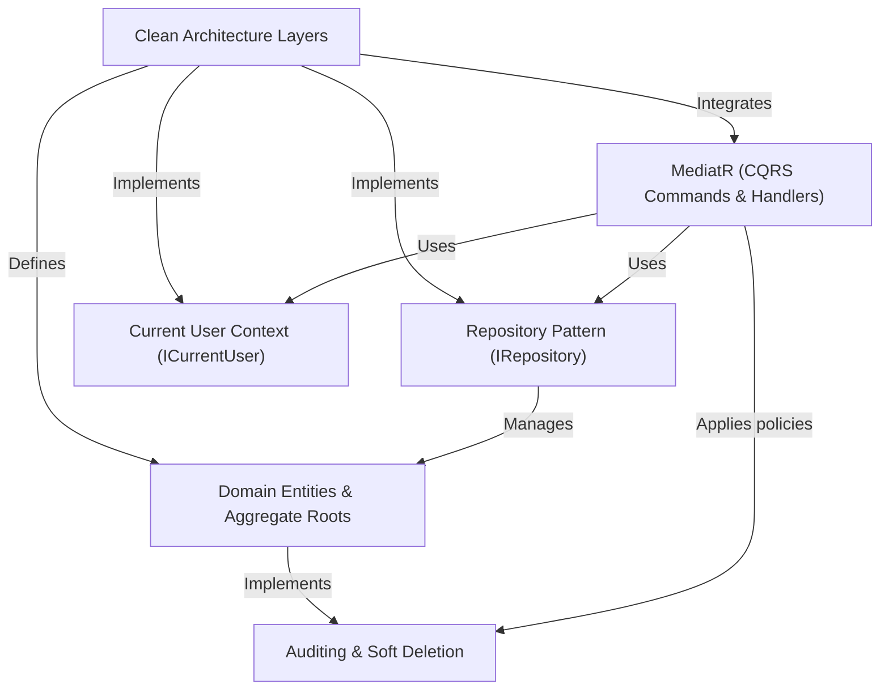

# Tutorial: CleanArchitecture

This project exemplifies a robust .NET application following *Clean Architecture* and *Domain-Driven Design (DDD)* principles. It distinctly separates code into `API`, `Application`, `Domain`, and `Infrastructure` layers to ensure business logic is **decoupled** from technical details. It leverages `MediatR` for the `CQRS` pattern, facilitating clear **command and query separation**, which enhances testability and maintainability. Key functionalities include managing core business entities like products and users, along with integrated **auditing** and **soft deletion** capabilities.

## Visual Overview

## Chapters

1. [Domain Entities & Aggregate Roots
](Z-Tutorials/01_domain_entities___aggregate_roots_.md)
2. [Auditing & Soft Deletion
](Z-Tutorials/02_auditing___soft_deletion_.md)
3. [Clean Architecture Layers
](Z-Tutorials/03_clean_architecture_layers_.md)
4. [Repository Pattern (IRepository<T>)
](Z-Tutorials/04_repository_pattern__irepository_t___.md)
5. [Current User Context (ICurrentUser)
](Z-Tutorials/05_current_user_context__icurrentuser__.md)
6. [MediatR (CQRS Commands & Handlers)
](Z-Tutorials/06_mediatr__cqrs_commands___handlers__.md)

---