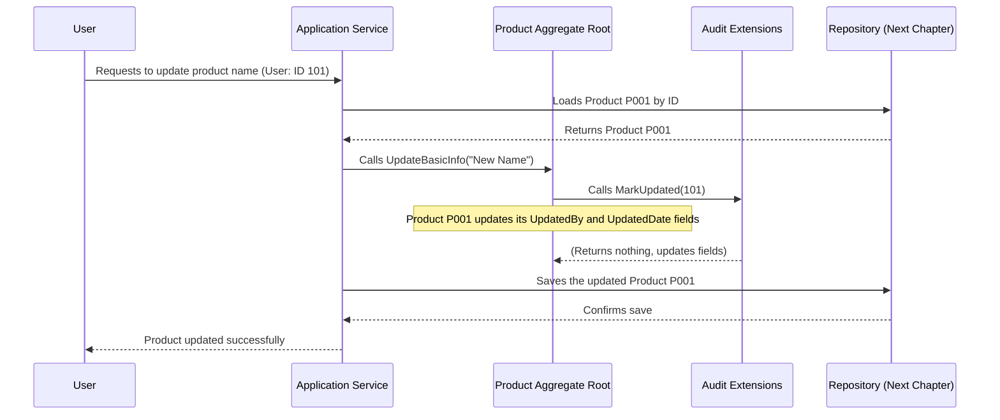
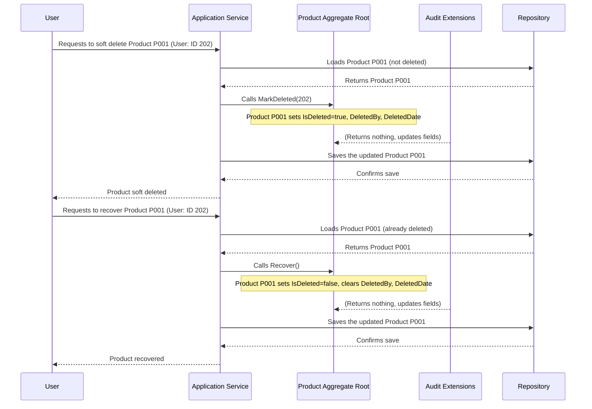

# Chapter 2: Auditing & Soft Deletion

Welcome back! In [Chapter 1: Domain Entities & Aggregate Roots](Z-Tutorials/01_domain_entities___aggregate_roots_.md), we learned how to define the core "things" in our business, like a `Product`, as distinct entities with unique identities. We also saw how `Product` acts as an Aggregate Root, controlling its internal data and enforcing business rules.

Now, let's make our `Product` (and other entities) even smarter by giving them the ability to keep a detailed history and to be "deleted" in a safe, reversible way. This is where **Auditing** and **Soft Deletion** come in.

## The Problem: Keeping a Logbook and Handling Deletions Safely

Imagine our online store again. What if:
*   You need to know **who** created a new product entry and **when**?
*   A customer complains about a wrong price. You need to know **who** last changed that price and **when** it happened.
*   Someone accidentally deletes a popular product. Can we get it back?
*   You want to temporarily remove a seasonal item from the store without permanently erasing all its data.

Without special mechanisms, answering these questions would be very difficult. We need a "logbook" for every change and a "recycle bin" for deleted items.

## Auditing: Keeping Track of Changes

**Auditing** is like having a detailed logbook for every important item (entity) in your system. It allows you to record:
*   **Who** created or updated an entity.
*   **When** that creation or update happened.

This is super useful for:
*   **Accountability:** Knowing who did what.
*   **Troubleshooting:** Pinpointing when an issue might have been introduced.
*   **Compliance:** Meeting legal or business requirements for data history.

In our project, we achieve this using simple "marker interfaces." An interface is like a contract; if a class says it implements an interface, it promises to have certain properties or methods.

### `ICreationTrackable`: For Creation Info

This interface tells us that an entity can track who created it and when.

```csharp
// File: SharedKernel/Interfaces/IAuditable.cs (Simplified)
namespace SharedKernel.Interfaces;

public interface ICreationTrackable
{
    long? CreatedBy { get; set; }    // Who created this? (e.g., User ID)
    DateTime? CreatedDate { get; set; } // When was it created?
}
```

If a `Product` implements `ICreationTrackable`, it will have `CreatedBy` and `CreatedDate` properties. When a new `Product` is added, these fields will be automatically filled in.

### `IUpdateTrackable`: For Update Info

Similar to creation tracking, this interface helps us track modifications.

```csharp
// File: SharedKernel/Interfaces/IAuditable.cs (Simplified)
namespace SharedKernel.Interfaces;

public interface IUpdateTrackable
{
    long? UpdatedBy { get; set; }    // Who last updated this?
    DateTime? UpdatedDate { get; set; } // When was it last updated?
}
```

Whenever a `Product` is changed (e.g., its name or price tiers), its `UpdatedBy` and `UpdatedDate` fields will be automatically updated.

## Soft Deletion: Deleting Without Really Deleting

**Soft Deletion** is a way to "delete" an entity without actually removing it from the database. Instead, we mark it as "deleted" (like moving it to a recycle bin). This is incredibly useful because:
*   **Data Recovery:** You can easily "undelete" or `Recover` an item if it was deleted by mistake.
*   **Historical Data:** You retain the full history of the item, even if it's no longer actively used.
*   **Referential Integrity:** Other parts of your system might still need to refer to a "deleted" item (e.g., an old order that referenced a now-deleted product).

### `ISoftDeletable`: For Soft Deletion

This interface defines the properties needed to mark an entity as soft-deleted.

```csharp
// File: SharedKernel/Interfaces/IAuditable.cs (Simplified)
namespace SharedKernel.Interfaces;

public interface ISoftDeletable
{
    bool IsDeleted { get; set; }        // Is this entity marked as deleted?
    long? DeletedBy { get; set; }       // Who marked it as deleted?
    DateTime? DeletedDate { get; set; } // When was it marked deleted?
}
```

An entity that implements `ISoftDeletable` will have an `IsDeleted` flag. When you "delete" it, this flag is set to `true`, and the `DeletedBy` and `DeletedDate` fields are recorded.

## How Our `Product` Entity Uses Auditing & Soft Deletion

Let's look at our `Product` entity from Chapter 1. It implements all these interfaces:

```csharp
// File: Domain/ProductModule/Entities/Product.cs (Simplified)
using SharedKernel.Base;
using SharedKernel.Interfaces;
// ... other usings

public class Product : Entity, ISoftDeletable, ICreationTrackable, IUpdateTrackable, IAggregateRoot
{
    // These properties come from the interfaces!
    public long? CreatedBy { get; set; }
    public DateTime? CreatedDate { get; set; }
    public long? UpdatedBy { get; set; }
    public DateTime? UpdatedDate { get; set; }
    public bool IsDeleted { get; set; }
    public long? DeletedBy { get; set; }
    public DateTime? DeletedDate { get; set; }

    // ... other Product properties (Code, Name, CostPrice, PriceTiers, etc.)

    // Example of a method updating product info
    public void UpdateBasicInfo(int updateBy, string name, ...)
    {
        Name = name;
        // ... update other properties
        this.MarkUpdated(updateBy); // This line is new!
    }

    // Example of a method updating price tiers
    public void UpdatePriceTiers(int updateBy, List<PriceTier> values)
    {
        // ... business rules check
        PriceTiers = values;
        this.MarkUpdated(updateBy); // This line is new!
    }

    // No explicit MarkDeleted or Recover methods here.
    // They are "extension methods" which we'll see next!
}
```

Notice how `Product` now has new properties like `CreatedBy` and `IsDeleted`. Also, inside its `UpdateBasicInfo` and `UpdatePriceTiers` methods, you see a new line: `this.MarkUpdated(updateBy);`. This is how we tell the system to record the update!

### Audit Extension Methods: Making it Easy

Instead of adding `MarkCreated`, `MarkUpdated`, `MarkDeleted`, and `Recover` methods to *every* entity, our project uses something called "Extension Methods." These are special methods that "extend" existing classes or interfaces without modifying them directly.

All the logic for updating these audit fields is neatly placed in a single static class: `AuditExtensions`.

```csharp
// File: SharedKernel/Base/AuditExtensions.cs (Simplified)
using SharedKernel.Interfaces;

namespace SharedKernel.Base;

public static class AuditExtensions // This class contains helpers
{
    public static void MarkCreated(this ICreationTrackable entity, long userId)
    {
        entity.CreatedBy = userId;
        entity.CreatedDate = DateTime.UtcNow; // Record current UTC time
    }

    public static void MarkUpdated(this IUpdateTrackable entity, long userId)
    {
        entity.UpdatedBy = userId;
        entity.UpdatedDate = DateTime.UtcNow;
    }

    public static void MarkDeleted(this ISoftDeletable entity, long userId)
    {
        entity.IsDeleted = true;
        entity.DeletedBy = userId;
        entity.DeletedDate = DateTime.UtcNow;
    }

    public static void Recover(this ISoftDeletable entity)
    {
        entity.IsDeleted = false;
        entity.DeletedBy = null;    // Clear deleted info
        entity.DeletedDate = null; // Clear deleted info
    }
}
```

The `this` keyword in `(this ICreationTrackable entity, ...)` makes it an extension method. This means you can now call `entity.MarkCreated(userId)` directly on any object that implements `ICreationTrackable`, `entity.MarkUpdated(userId)` on `IUpdateTrackable`, and `entity.MarkDeleted(userId)` or `entity.Recover()` on `ISoftDeletable` objects. It's clean and reusable!

## How it Works Under the Hood

Let's see the flow when you update a product and then soft-delete it.

### Scenario 1: Updating a Product (with Auditing)



1.  **User Request:** A user (ID 101) wants to change a product's name.
2.  **Application Service:** An [Application Service](Z-Tutorials/03_clean_architecture_layers_.md) receives this request and loads the specific `Product` Aggregate Root (e.g., product P001) from the database using a [Repository](Z-Tutorials/04_repository_pattern__irepository_t___.md).
3.  **Execute Business Logic & Audit:** The Application Service calls `UpdateBasicInfo` on the `Product` Aggregate Root. Inside this method, the `Product` updates its `Name` and then calls `this.MarkUpdated(101)`.
4.  **Audit Extension Magic:** The `MarkUpdated` extension method (from `AuditExtensions`) then sets `Product.UpdatedBy` to 101 and `Product.UpdatedDate` to the current time.
5.  **Save Changes:** Finally, the Application Service tells the Repository to save the `Product` back to the database. The database now stores the new name, *and* who updated it and when.

### Scenario 2: Soft Deleting and Recovering a Product



1.  **Soft Delete Request:** A user (ID 202) wants to soft delete Product P001.
2.  **Application Service & Load:** The [Application Service](Z-Tutorials/03_clean_architecture_layers_.md) loads Product P001.
3.  **Mark Deleted:** The Application Service directly calls the `MarkDeleted` extension method on the `Product` object: `product.MarkDeleted(202);`. This method (from `AuditExtensions`) sets `IsDeleted` to `true`, records `DeletedBy` (202), and `DeletedDate`.
4.  **Save Changes:** The `Product` object (with its `IsDeleted` flag set) is saved back to the database. The product is now "soft-deleted" – it's still in the database but marked as inactive. When querying for active products, we'd typically filter out those with `IsDeleted = true`.

5.  **Recovery Request:** Later, the same user wants to recover Product P001.
6.  **Application Service & Load:** The Application Service loads the soft-deleted Product P001.
7.  **Recover:** The Application Service calls the `Recover` extension method on the `Product` object: `product.Recover();`. This method (from `AuditExtensions`) sets `IsDeleted` back to `false` and clears the `DeletedBy` and `DeletedDate` fields.
8.  **Save Changes:** The `Product` object is saved back to the database. It is now active again!

### The Generic Handlers

The project also provides generic handlers that encapsulate the common logic for soft deleting and recovering *any* `Entity` that implements `ISoftDeletable` and `IAggregateRoot`.

Here's how a generic soft delete handler uses our concept:

```csharp
// File: Application/UseCases/BaseAuditable/SoftDelete/GenericSoftDeleteHandler.cs (Simplified)
using SharedKernel.Interfaces;
using MediatR; // From MediatR library (covered in a later chapter)
using SharedKernel.Base;

namespace Application.UseCases.BaseAuditable.SoftDelete;

public abstract class GenericSoftDeleteHandler<TEntity, TCommand> : IRequestHandler<TCommand, bool>
    // TEntity must be an Entity, SoftDeletable, and AggregateRoot
    where TEntity : Entity, ISoftDeletable, IAggregateRoot
    where TCommand : GenericSoftDeleteCommand
{
    private readonly IRepository<TEntity> _repository;

    protected GenericSoftDeleteHandler(IRepository<TEntity> repository)
    {
        _repository = repository;
    }

    public async Task<bool> Handle(TCommand request, CancellationToken cancellationToken)
    {
        // Find entities by their IDs (typically not deleted ones)
        var entities = await _repository.ListAsync(
            new EntitiesByIdsSpecification<TEntity>(request.Ids, false), // Fetch non-deleted items
            cancellationToken
        );

        foreach (var entity in entities)
        {
            entity.MarkDeleted(request.UserId); // Use the extension method!
        }

        await _repository.UpdateRangeAsync(entities, cancellationToken); // Save all changes
        return true;
    }
}
```

This handler receives a `GenericSoftDeleteCommand` (which contains a list of IDs and the `UserId` performing the action). It then loads the entities and, for each one, calls `entity.MarkDeleted(request.UserId)`. This single line of code leverages our `AuditExtensions` to mark the entity as soft-deleted.

The `GenericRecoveryHandler` works similarly, calling `entity.Recover()` on the entity. This shows how simple and reusable the auditing and soft deletion logic becomes when defined at the core `Entity` level and managed with extension methods.

## Conclusion

In this chapter, we explored how **Auditing** helps us keep a detailed log of who created and updated our entities, and **Soft Deletion** provides a safe, reversible way to "delete" items without losing their data. We saw how simple interfaces like `ICreationTrackable`, `IUpdateTrackable`, and `ISoftDeletable`, combined with powerful `AuditExtensions`, enable these crucial features across all our [Domain Entities](Z-Tutorials/01_domain_entities___aggregate_roots_.md).

By embedding these capabilities directly into our entities, we ensure that every significant action (creation, update, soft deletion, recovery) is automatically tracked, making our application more robust, accountable, and user-friendly.

Next, we'll zoom out from individual entities to understand the bigger picture: how our application is structured into different layers, a concept known as [Clean Architecture Layers](Z-Tutorials/03_clean_architecture_layers_.md).

---