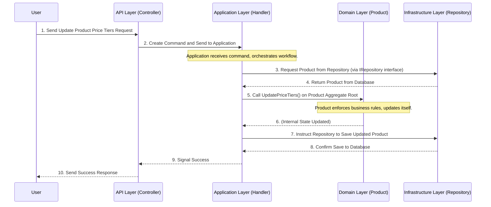

# Chapter 3: Clean Architecture Layers

Welcome back! In our previous chapters, [Chapter 1: Domain Entities & Aggregate Roots](Z-Tutorials/01_domain_entities___aggregate_roots_.md) and [Chapter 2: Auditing & Soft Deletion](Z-Tutorials/02_auditing___soft_deletion_.md), we focused on the very core of our application: the business rules, entities like `Product`, and how they manage their own state and history. These concepts are crucial, but they are just one piece of a larger puzzle.

Now, let's zoom out and understand how these core pieces fit into the entire application. How do we organize all the code – the web requests, the database interactions, the business logic – so that everything stays clean, easy to understand, test, and change?

## The Problem: Organizing a Growing Application

Imagine building a house. You wouldn't put the kitchen sink in the living room, or the bedroom in the garage, right? Each part of the house has a specific purpose, and they're all connected in an organized way.

Similarly, in software, as our applications grow, they can become messy. If your web code directly talks to the database, and your business rules are mixed everywhere, then:
*   Changing the database type (e.g., from SQL Server to PostgreSQL) could break your web interface.
*   Updating a business rule might require changes in many different parts of the code.
*   Testing specific business rules becomes hard because they are tangled with other technical details.

We need a clear way to separate responsibilities, like having different rooms in a house, so that changes in one area don't unexpectedly affect others.

## The Solution: Clean Architecture Layers

**Clean Architecture** is a design philosophy that helps us organize our code into distinct, isolated layers. Think of it like a set of **concentric circles**, with the most important and stable code at the very center.

The key idea is the **Dependency Rule**:
**Inner layers never depend on outer layers.** Outer layers can depend on inner layers.

This means the core business logic (at the center) knows nothing about the web interface, the database, or any other external details. This makes the business logic highly stable, reusable, and easy to test, as it's not tied to any specific technology.

Our project uses four main layers:

| Layer Name     | Purpose & Analogy                     | What's Inside (Examples)           | Dependencies (What it **knows about**) |
| :------------- | :------------------------------------ | :--------------------------------- | :------------------------------------- |
| `Domain`       | **Core Business Rules (The Brain)**. The most important, independent part. | `Product` (Entities), `PriceTier` (Value Objects), `ProductRules` | None (only `SharedKernel` for common bases) |
| `Application`  | **Business Workflows (The Manager)**. Orchestrates tasks using core rules. | Use Cases (e.g., "Create Product", "Update Product"), Commands, Queries | `Domain`, `SharedKernel`           |
| `Infrastructure` | **External Details (The Tools)**. How we talk to databases, external services. | Database setup (e.g., SQL Server), Repository implementations, external API clients | `Application`, `Domain`, `SharedKernel` |
| `API`          | **Presentation (The Face)**. How users interact with the system (e.g., web interface). | Web Controllers (e.g., for products), Authentication | `Application`, `Infrastructure` (for setup) |
| `SharedKernel` | **Common Utilities (The Toolbox)**. General helpers used by many layers. | `Entity` base class, `IAggregateRoot` interface, `IRepository<T>` interface, audit extensions | None (it's completely independent) |

Let's explore each layer:

### 1. `Domain` Layer: The Core Business Rules

*   **Purpose:** This is the heart of your application. It contains all the essential business rules, concepts, and data structures (your [Domain Entities & Aggregate Roots](Z-Tutorials/01_domain_entities___aggregate_roots_.md) and Value Objects). It's where the unique behavior of your business lives.
*   **What's Inside:** Our `Product`, `PriceTier`, and the methods like `UpdatePriceTiers` that enforce business rules are all in the `Domain` layer.
*   **Dependencies:** This layer is the most independent. It *never* depends on any other layers (like `Application`, `Infrastructure`, or `API`). It only depends on `SharedKernel` for common base classes or interfaces. This means your core business logic is not tied to any specific database, web framework, or UI.

**File Path Example:** `Domain/ProductModule/Entities/Product.cs`
We saw this in [Chapter 1](Z-Tutorials/01_domain_entities___aggregate_roots_.md):

```csharp
// File: Domain/ProductModule/Entities/Product.cs (Simplified)
using SharedKernel.Base; // From SharedKernel!
using SharedKernel.Interfaces; // From SharedKernel!

public class Product : Entity, IAggregateRoot // Part of the Domain layer
{
    public string Name { get; private set; } = string.Empty;
    // ... other properties

    public void UpdatePriceTiers(int updateBy, List<PriceTier> values)
    {
        // This is a business rule, handled by the Domain layer itself!
        // ProductRules.EnsureValidPriceTiers(values); 
        PriceTiers = values;
        this.MarkUpdated(updateBy); // Uses an extension method from SharedKernel
    }
}
```
This `Product` class defines what a product is and how it behaves according to our business rules. It has no idea if it's being used in a web application, a desktop app, or if its data is stored in SQL Server or a text file.

**Project Reference in `Domain.csproj`:**
The `Domain` project only refers to `SharedKernel`, confirming its independence from other business layers.

```xml
<!-- File: Domain/Domain.csproj (Snippet) -->
<Project Sdk="Microsoft.NET.Sdk">
  <ItemGroup>
    <ProjectReference Include="..\SharedKernel\SharedKernel.csproj" />
  </ItemGroup>
  <!-- ... -->
</Project>
```

### 2. `Application` Layer: Business Workflows

*   **Purpose:** This layer contains the "use cases" or "application services" that orchestrate the flow of data and interaction with the `Domain` layer to fulfill a specific business task (e.g., "Create a Product", "Update Product Prices", "Register a User"). It defines *what* the application can do.
*   **What's Inside:** Command/Query handlers (using MediatR, which we'll cover in [Chapter 6: MediatR (CQRS Commands & Handlers)](Z-Tutorials/06_mediatr__cqrs_commands___handlers__.md)), business workflow logic, and interfaces that `Infrastructure` will implement (like `IRepository<T>`).
*   **Dependencies:** It depends on the `Domain` layer (to use entities and their methods) and `SharedKernel`. It defines interfaces that external layers (like `Infrastructure`) must implement.

**File Path Example:** `Application/UseCases/BaseAuditable/SoftDelete/GenericSoftDeleteHandler.cs`
We saw a simplified version of this handler in [Chapter 2](Z-Tutorials/02_auditing___soft_deletion_.md):

```csharp
// File: Application/UseCases/BaseAuditable/SoftDelete/GenericSoftDeleteHandler.cs (Simplified)
using Domain.ProductModule.Entities; // Uses an Entity from Domain!
using SharedKernel.Interfaces; // Uses interfaces from SharedKernel!

public class GenericSoftDeleteHandler<TEntity, TCommand> // In Application layer
    where TEntity : Entity, ISoftDeletable, IAggregateRoot
{
    // This _repository is an INTERFACE (e.g., IRepository<TEntity>)
    // The actual implementation (how it talks to a database) is in Infrastructure
    private readonly IRepository<TEntity> _repository; 

    public async Task<bool> Handle(TCommand request, CancellationToken cancellationToken)
    {
        var entities = await _repository.ListAsync(...); // Asks Infrastructure via interface
        foreach (var entity in entities)
        {
            entity.MarkDeleted(request.UserId); // Calls method on Domain entity
        }
        await _repository.UpdateRangeAsync(entities, cancellationToken);
        return true;
    }
}
```
This code defines *how* to soft-delete an entity. It uses the `Product` entity (from `Domain`) and uses an `IRepository` interface. It doesn't know *how* the repository talks to the database, only *that* it can.

**Project Reference in `Application.csproj`:**
The `Application` project references `Domain` and `SharedKernel`.

```xml
<!-- File: Application/Application.csproj (Snippet) -->
<Project Sdk="Microsoft.NET.Sdk">
  <ItemGroup>
    <ProjectReference Include="..\Domain\Domain.csproj" />
    <ProjectReference Include="..\SharedKernel\SharedKernel.csproj" />
  </ItemGroup>
  <!-- ... -->
</Project>
```

### 3. `Infrastructure` Layer: External Details

*   **Purpose:** This layer handles all "external" concerns, meaning things outside your core business logic. This includes talking to databases, external APIs (like payment gateways), sending emails, or interacting with the file system. It *implements* the interfaces defined in the `Application` layer.
*   **What's Inside:** Database Contexts (like `AppDbContext`), concrete implementations of `IRepository<T>`, actual email sending services, etc.
*   **Dependencies:** It depends on the `Application` layer (to implement its interfaces) and the `Domain` layer (to work with entities). It also depends on `SharedKernel`.

**File Path Example:** `Infrastructure/Persistences/AppDbContext.cs` and actual `IRepository<T>` implementations.

```csharp
// File: Infrastructure/Persistences/AppDbContext.cs (Simplified)
using Microsoft.EntityFrameworkCore; // Database framework!
using Domain.ProductModule.Entities; // Needs to know about Domain Entities

namespace Infrastructure.Persistences;

public class AppDbContext : DbContext // Lives in Infrastructure layer
{
    public AppDbContext(DbContextOptions<AppDbContext> options) : base(options) { }

    public DbSet<Product> Products { get; set; } // Works with Domain's Product
    // ... other DbSets
}
```
This `AppDbContext` knows how to map your `Product` entities to database tables. This is a technical detail that `Domain` and `Application` don't need to know about.

**Project Reference in `Infrastructure.csproj`:**
The `Infrastructure` project references `Application`, `Domain`, and `SharedKernel`. This is perfectly fine, as `Infrastructure` is an outer layer implementing details for inner layers.

```xml
<!-- File: Infrastructure/Infrastructure.csproj (Snippet) -->
<Project Sdk="Microsoft.NET.Sdk">
  <ItemGroup>
    <ProjectReference Include="..\Application\Application.csproj" />
    <ProjectReference Include="..\Domain\Domain.csproj" />
    <ProjectReference Include="..\SharedKernel\SharedKernel.csproj" />
  </ItemGroup>
  <!-- ... -->
</Project>
```

### 4. `API` Layer: Presentation

*   **Purpose:** This is the outermost layer, the entry point for users. It handles web requests (like an HTTP API), user interface interactions, or command-line inputs. It typically just translates external requests into calls to the `Application` layer and formats the results back to the user.
*   **What's Inside:** Web Controllers (e.g., `ProductsController`), presentation models (DTOs), authentication setup.
*   **Dependencies:** It depends on the `Application` layer (to trigger use cases) and sometimes `Infrastructure` (for setting up things like dependency injection for the database).

**File Path Example:** `API/Controller/ProductController.cs`

```csharp
// File: API/Controller/ProductController.cs (Simplified)
using MediatR; // To send commands to Application layer!
using Microsoft.AspNetCore.Mvc; // Web framework!

namespace API.Controller;

[ApiController]
[Route("[controller]")]
public class ProductsController : ControllerBase // In API layer
{
    private readonly IMediator _mediator; // From Application layer (MediatR)

    public ProductsController(IMediator mediator)
    {
        _mediator = mediator;
    }

    [HttpPut("price-tiers")]
    public async Task<IActionResult> UpdateProductPriceTiers([FromBody] UpdateProductPriceTiersCommand command)
    {
        // This is a "command" (request) sent to the Application layer
        await _mediator.Send(command); 
        return Ok();
    }
}
```
This controller receives a web request, packages the data into a "command" object, and sends it to the `Application` layer. It doesn't contain any business logic itself.

**Project Reference in `API.csproj`:**
The `API` project references `Application` and `Infrastructure`.

```xml
<!-- File: API/API.csproj (Snippet) -->
<Project Sdk="Microsoft.NET.Sdk.Web">
  <ItemGroup>
    <ProjectReference Include="..\Application\Application.csproj" />
    <ProjectReference Include="..\Infrastructure\Infrastructure.csproj" />
  </ItemGroup>
  <!-- ... -->
</Project>
```

### 5. `SharedKernel` Layer: Common Utilities

*   **Purpose:** This is the "toolbox" layer. It holds common, generic components that can be used across *all* other layers without introducing circular dependencies. This includes base classes, shared interfaces, common exceptions, or utility functions that are truly universal.
*   **What's Inside:** Our `Entity` base class, `IAggregateRoot`, `ICreationTrackable`, `ISoftDeletable` interfaces, and the `AuditExtensions` are all in `SharedKernel`. Also, the generic `IRepository<T>` interface is here.
*   **Dependencies:** It has *no* dependencies on any other project layers (`Domain`, `Application`, `Infrastructure`, `API`). This makes it incredibly stable and reusable.

**Project Reference in `SharedKernel.csproj`:**
Notice that `SharedKernel.csproj` has *no* `<ProjectReference>` items!

```xml
<!-- File: SharedKernel/SharedKernel.csproj (Snippet) -->
<Project Sdk="Microsoft.NET.Sdk">
  <PropertyGroup>
    <TargetFramework>net9.0</TargetFramework>
    <ImplicitUsings>enable</ImplicitUsings>
    <Nullable>enable</Nullable>
  </PropertyGroup>
  <!-- No ProjectReference here! -->
</Project>
```

## How it Works Under the Hood: The Request Flow

Let's trace our familiar use case: **Update Product Price Tiers** to see how these layers interact.

Imagine you, as a user, want to update the price tiers of a product through a web interface.



1.  **User Request:** You click a button or send data from a form. Your web browser sends an HTTP request to the `API` layer.
2.  **API Layer (Controller):** The `ProductsController` (in the `API` layer) receives this request. It doesn't contain business logic. Instead, it creates a "command" (a simple data object describing what you want to do) and sends it to the `Application` layer via `IMediator`.
3.  **Application Layer (Handler):** A specific "handler" in the `Application` layer (e.g., `UpdateProductPriceTiersHandler`) receives the command. This handler is responsible for the business workflow.
    *   It first asks the `IRepository<Product>` (an interface it knows about from `SharedKernel` or `Application` itself) to load the correct `Product` from storage.
    *   Crucially, the `Application` layer doesn't know *how* the `IRepository` gets the product (e.g., from SQL Server, a NoSQL database, or even memory). It just knows *that* it can.
4.  **Infrastructure Layer (Repository Implementation):** The `Infrastructure` layer contains the actual implementation of `IRepository<Product>` (e.g., `ProductRepository`), which knows how to interact with the database (using `AppDbContext`) to fetch the `Product` data. It returns the `Product` object to the `Application` layer.
5.  **Application Layer (Back to Handler):** Once the `Product` object is loaded, the `Application` handler calls the `UpdatePriceTiers()` method directly on the `Product` (our [Aggregate Root](Z-Tutorials/01_domain_entities___aggregate_roots_.md) in the `Domain` layer).
6.  **Domain Layer (Product Aggregate Root):** The `Product` object (in the `Domain` layer) receives the call. It contains and enforces its own business rules (e.g., ensuring prices are positive). It updates its internal `PriceTiers` list and marks itself as updated (using `AuditExtensions` from `SharedKernel`). The `Domain` layer has no idea that the call originated from a web request or that the data will be saved to a database.
7.  **Application Layer (Back to Handler):** After the `Product` has updated its internal state, the `Application` handler instructs the `IRepository` to save the changes back to storage.
8.  **Infrastructure Layer (Repository Implementation):** The `Infrastructure` layer's `ProductRepository` handles saving the modified `Product` object to the database.
9.  **Application Layer -> API Layer:** The `Application` handler finishes its work and signals success back to the `API` layer.
10. **API Layer (Controller):** The `ProductsController` receives the success signal and sends an appropriate HTTP response back to your web browser.

This entire flow demonstrates how each layer plays its distinct role. The core business rules in `Domain` are never directly touched by the `API` or `Infrastructure` layers. The `Application` layer acts as the coordinator, using interfaces to communicate with the `Infrastructure` without caring about implementation details.

## Conclusion

In this chapter, we've explored the fundamental concept of **Clean Architecture Layers**. We learned how separating our code into distinct layers – `Domain`, `Application`, `Infrastructure`, `API`, and `SharedKernel` – helps keep our application organized, makes our core business logic independent and testable, and allows us to easily swap out technical details (like databases or UI frameworks) without affecting the heart of our system. This structure is key to building maintainable, scalable, and robust applications.

Next, we'll dive into one of the crucial patterns that enables this layered architecture: the [Repository Pattern (IRepository<T>)](Z-Tutorials/04_repository_pattern__irepository_t___.md), which bridges the gap between our `Application` layer and the data storage in `Infrastructure`.

---
