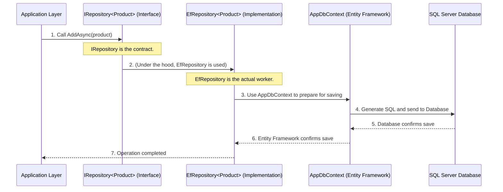

# Chapter 4: Repository Pattern (IRepository<T>)

Welcome back! In [Chapter 3: Clean Architecture Layers](Z-Tutorials/03_clean_architecture_layers_.md), we learned how to organize our application into distinct layers – `Domain`, `Application`, `Infrastructure`, `API`, and `SharedKernel` – to keep our code clean and maintainable. We saw how the `Application` layer orchestrates business tasks, using our core `Domain` entities, but it needs a way to store and retrieve these entities.

Now, let's tackle a crucial piece of this puzzle: How does our `Application` layer get data (like a `Product`) from the database, and how does it save changes back, without ever knowing the messy details of databases like SQL Server? This is where the **Repository Pattern** comes in!

## The Problem: Bridging the Gap to Data

Imagine you're a chef in a restaurant (your `Application` layer). You know *what* you need to cook (your business logic), and you have the recipes (your `Domain` entities and their rules). But you don't want to worry about *how* the ingredients are grown on the farm (the database technology), how they are delivered, or how they are stored in the pantry. You just want to ask for "a product" and get it, or tell someone to "store this new product" and have it handled.

If your chef (Application layer) had to directly call the farm (database) using complicated farming tools (SQL commands or specific Entity Framework details), then:
*   If you change farms (switch from SQL Server to PostgreSQL), the chef's recipe (application code) would break.
*   The chef's job would be much harder, mixing cooking with farming.
*   It would be difficult to test recipes without a real farm.

We need a middle-person, someone who knows how to talk to the database farm, fetch ingredients, and store new ones, so the chef can focus on cooking.

## The Solution: The Repository Pattern

The **Repository Pattern** provides this middle-person. It's like having a **librarian** for your data. When you (your `Application` layer) need a specific book (a `Product` entity), you don't go rummaging through the shelves yourself. You simply ask the librarian. The librarian knows exactly where the book is, how it's organized, and how to retrieve it. You don't need to know the shelf number or the library's internal system.

Similarly, a "Repository" provides an abstract (simplified) way to work with your [Aggregate Roots](Z-Tutorials/01_domain_entities___aggregate_roots_.md) (like `Product`). It hides all the complex database operations from your business logic.

### 1. The `IRepository<T>` Interface (The Contract)

In our project, the core of the Repository Pattern is the `IRepository<T>` interface. An **interface** is like a contract or a blueprint. It defines *what* operations a repository *must* provide, but not *how* it performs them.

Here's a simplified version of `IRepository<T>`:

```csharp
// File: SharedKernel/Interfaces/IRepository.cs
using Ardalis.Specification; // A library for powerful queries
using SharedKernel.Interfaces; // For IAggregateRoot

namespace SharedKernel.Interfaces;

public interface IRepository<T> : IRepositoryBase<T> // This is our contract!
    where T : class, IAggregateRoot // T must be an Aggregate Root!
{
    // This property allows for advanced query building, which we'll see later.
    // Think of it as access to the main list of all items of type T.
    IQueryable<T> Table { get; }
}
```

**Explanation:**
*   `IRepository<T>` is a "generic" interface. The `<T>` means it can work with *any* type of `AggregateRoot` (like `Product`, `Order`, `User`, etc.). So, you can have `IRepository<Product>` for products, `IRepository<Order>` for orders, and so on.
*   `where T : class, IAggregateRoot` ensures that `T` can only be a class that also implements `IAggregateRoot`. This is a core rule: repositories only deal with [Aggregate Roots](Z-Tutorials/01_domain_entities___aggregate_roots_.md)!
*   `IRepositoryBase<T>` comes from an external library (`Ardalis.Specification`) and automatically provides common methods like `AddAsync`, `UpdateAsync`, `DeleteAsync`, `GetByIdAsync`, `ListAsync`, etc. This saves us a lot of repetitive coding!
*   This interface lives in the `SharedKernel` layer. Why? Because both the `Application` layer (which *uses* the repository) and the `Infrastructure` layer (which *implements* it) need to know about this contract. Placing it in `SharedKernel` ensures no circular dependencies.

### 2. The `EfRepository<T>` Implementation (The Librarian's Assistant)

While `IRepository<T>` defines *what* operations are available, `EfRepository<T>` provides the actual *how*. This is the class that knows how to talk to a specific database technology, in our case, **Entity Framework Core** with **SQL Server**.

```csharp
// File: Infrastructure/Persistences/EfRepository.cs
using Ardalis.Specification.EntityFrameworkCore;
using SharedKernel.Interfaces; // For IRepository and IAggregateRoot
using Infrastructure.Persistence; // For AppDbContext

namespace Infrastructure.Persistence;

public class EfRepository<T> : RepositoryBase<T>, IRepository<T>
    where T : class, IAggregateRoot // It implements our IRepository contract!
{
    // This is the bridge to the actual database!
    AppDbContext _dbContext;

    // Constructor: Entity Framework will give us the database context
    public EfRepository(AppDbContext dbContext) : base(dbContext)
    {
        _dbContext = dbContext;
    }

    // Provides access to the DbSet for querying
    private IQueryable<T>? _entities;
    public virtual IQueryable<T> Table => _entities ?? (_entities = _dbContext.Set<T>());
}
```

**Explanation:**
*   `EfRepository<T>` implements our `IRepository<T>` interface, fulfilling the contract.
*   It inherits from `RepositoryBase<T>` (again from `Ardalis.Specification`), which handles most of the common database operations (like `AddAsync`, `UpdateAsync`).
*   The key here is `AppDbContext`. This is an Entity Framework Core class (from the `Infrastructure` layer) that directly connects to your SQL Server database. `EfRepository<T>` uses this `_dbContext` to perform the actual saving, loading, updating, and deleting.
*   This class lives in the `Infrastructure` layer, keeping all the database-specific details isolated from our `Application` and `Domain` layers.

## How to Use the Repository in Our Application

Let's revisit our `CreateProductHandler` from [Chapter 3](Z-Tutorials/03_clean_architecture_layers_.md) to see how simple it is to use the `IRepository<T>` interface.

The `Application` layer needs to create a new `Product` and save it. It will use `IRepository<Product>`.

```csharp
// File: Application/UseCases/ProductModule/Commands/CreateProduct/CreateProductHandler.cs (Simplified)
using Domain.ProductModule.Entities; // Product is an Aggregate Root
using MediatR; // For handling commands
using SharedKernel.Interfaces; // For IRepository and ICurrentUser

namespace Application.Commands.ProductModule.CreateProduct;

public class CreateProductHandler : IRequestHandler<CreateProductCommand, long>
{
    // We depend on the INTERFACE, not the specific EfRepository implementation!
    private readonly IRepository<Product> _productRepository;
    private readonly ICurrentUser _currentUser; // (From next chapter)

    public CreateProductHandler(
        ICurrentUser currentUser,
        IRepository<Product> productRepository // Here we get the repository!
    )
    {
        _currentUser = currentUser;
        _productRepository = productRepository;
    }

    public async Task<long> Handle(CreateProductCommand request, CancellationToken cancellationToken)
    {
        // 1. Create the Product Aggregate Root (Domain layer logic)
        // This Product object is created in memory.
        var product = new Product(
            request.Code,
            request.Name,
            request.CostPrice,
            // ... other initial properties
        );

        // 2. Add the Product to the repository (Application layer using the interface)
        // We tell the repository to save this product.
        await _productRepository.AddAsync(product, cancellationToken);

        // After this line, the product is saved to the database!
        return product.Id; // Return the new product's ID
    }
}
```

**Explanation:**
1.  Notice that `CreateProductHandler` asks for `IRepository<Product>` in its constructor. It doesn't care if it's `EfRepository`, `MongoDbRepository`, or `InMemoryRepository`. It just needs an object that can fulfill the `IRepository` contract.
2.  After creating a `Product` object (our [Aggregate Root](Z-Tutorials/01_domain_entities___aggregate_roots_.md) from the `Domain` layer), the handler simply calls `await _productRepository.AddAsync(product, cancellationToken);`. This is a clean, abstract way to tell the system to save the `product` to persistent storage.
3.  Similarly, to retrieve entities, you'd use `await _productRepository.ListAsync(...)` or `await _productRepository.GetByIdAsync(...)`. To update them after making changes to the `Aggregate Root` in memory, you'd use `await _productRepository.UpdateAsync(...)` or `await _productRepository.UpdateRangeAsync(...)`. The `Application` layer doesn't need to write any SQL queries!

This clearly shows the **Dependency Rule** in action from [Chapter 3: Clean Architecture Layers](Z-Tutorials/03_clean_architecture_layers_.md): the `Application` layer (inner) depends on the `IRepository` interface (from `SharedKernel`, which is also an inner layer concern for interfaces), but it *does not* depend on `EfRepository` or `AppDbContext` (which are in the `Infrastructure` outer layer).

## How It Works Under the Hood

Let's trace the flow when the `Application` layer wants to save a new `Product` using the Repository Pattern.

### The Journey of Saving a Product



1.  **Application Layer:** Your `CreateProductHandler` (in the `Application` layer) calls `_productRepository.AddAsync(product)`. It thinks it's talking to `IRepository<Product>`.
2.  **The Magic of Dependency Injection:** At runtime, the application knows that `EfRepository<Product>` is the actual class that fulfills the `IRepository<Product>` contract. So, the call is seamlessly directed to `EfRepository<Product>`. (We'll see how this "magic" happens in the next section).
3.  **EfRepository<Product>:** The `EfRepository` receives the `product` object. It uses the `AppDbContext` (its connection to Entity Framework Core) to tell Entity Framework that this `product` needs to be added to the database.
4.  **AppDbContext (Entity Framework Core):** `AppDbContext` translates the `AddAsync` operation into specific SQL commands. It then sends these SQL commands to the actual SQL Server database.
5.  **SQL Server Database:** The database executes the SQL commands, saving the `product` data.
6.  **Confirmation:** The database confirms success back to `AppDbContext`, which in turn confirms to `EfRepository`, and finally, the `Application` layer receives the confirmation that the product has been saved.

Throughout this entire process, the `Application` layer only knows about the `IRepository<T>` interface and the `Product` entity. It remains completely decoupled from Entity Framework Core and SQL Server details!

### Connecting the Pieces: Dependency Injection

You might be wondering: If `CreateProductHandler` asks for `IRepository<Product>`, but `EfRepository<Product>` is the actual object, how does the system know to give `EfRepository` to the handler? This is done through a powerful technique called **Dependency Injection (DI)**.

Essentially, when your application starts, you "register" which concrete class should be used when an interface is requested. In our project, this setup happens in the `Infrastructure` layer.

```csharp
// File: Infrastructure/DependencyInjection/DependencyInjection.cs (Simplified)
using Microsoft.Extensions.DependencyInjection; // For DI
using Infrastructure.Persistence; // For AppDbContext and EfRepository
using SharedKernel.Interfaces; // For IRepository

namespace Infrastructure.DependencyInjection;

public static class DependencyInjection
{
    public static IServiceCollection AddInfrastructure(this IServiceCollection services, string connectionString)
    {
        // 1. Register AppDbContext: Tell the system how to create AppDbContext
        services.AddDbContext<AppDbContext>(options =>
            options.UseSqlServer(connectionString)); // We're using SQL Server!

        // 2. Register Repository: When someone asks for IRepository<T>,
        //    give them an instance of EfRepository<T>
        services.AddScoped(typeof(IRepository<>), typeof(EfRepository<>));

        // ... other infrastructure services
        return services;
    }
}
```

**Explanation:**
*   The `AddInfrastructure` method (which is called when the application starts up) is where we set up these connections.
*   `services.AddDbContext<AppDbContext>(...)` tells the Dependency Injection system how to create an `AppDbContext` instance, including connecting it to a SQL Server database using the `connectionString`.
*   `services.AddScoped(typeof(IRepository<>), typeof(EfRepository<>))` is the key line for our Repository Pattern. It says: "Whenever any part of the application (like our `CreateProductHandler`) asks for an object of type `IRepository<Something>`, please create and provide an instance of `EfRepository<Something>`." The `Scoped` part means a new instance is created for each web request, which is typical for database contexts.

This setup makes sure that `Application` layer's `CreateProductHandler` always receives a working `EfRepository` object behind the `IRepository` interface, without ever needing to know its name or location.

## Conclusion

In this chapter, we explored the **Repository Pattern** as a vital abstraction in Clean Architecture. We learned how the `IRepository<T>` interface (the contract in `SharedKernel`) defines *what* data operations are available for our [Aggregate Roots](Z-Tutorials/01_domain_entities___aggregate_roots_.md), and how `EfRepository<T>` (the implementation in `Infrastructure`) provides the *how* using Entity Framework Core to interact with the database.

By using the Repository Pattern, our `Application` layer can easily save, load, and manage `Domain` entities without being tied to any specific database technology. This keeps our core business logic clean, testable, and adaptable to future changes.

Next, we will look at [Current User Context (ICurrentUser)](Z-Tutorials/05_current_user_context__icurrentuser__.md), which helps us know "who" is performing actions in our application, a detail crucial for features like [Auditing](Z-Tutorials/02_auditing___soft_deletion_.md) that we discussed earlier.

---