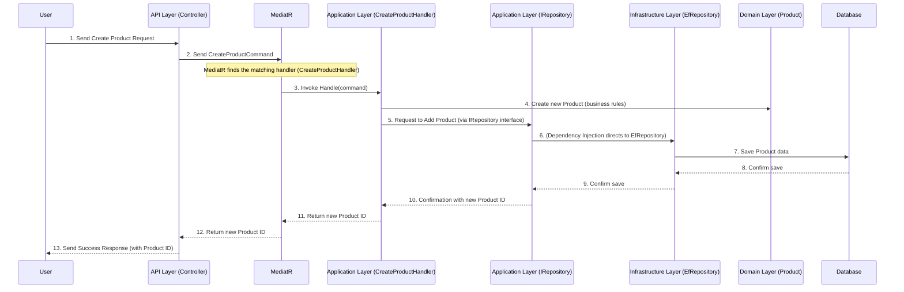

# Chapter 6: MediatR (CQRS Commands & Handlers)

Welcome back! In our previous chapters, we built a strong foundation for our application:
*   [Chapter 1: Domain Entities & Aggregate Roots](Z-Tutorials/01_domain_entities___aggregate_roots_.md) defined our core business "things."
*   [Chapter 2: Auditing & Soft Deletion](Z-Tutorials/02_auditing___soft_deletion_.md) added tracking and safe deletion.
*   [Chapter 3: Clean Architecture Layers](Z-Tutorials/03_clean_architecture_layers_.md) taught us how to organize our code into distinct layers.
*   [Chapter 4: Repository Pattern (IRepository<T>)](Z-Tutorials/04_repository_pattern__irepository_t___.md) showed us how to save and load our "things" from the database.
*   [Chapter 5: Current User Context (ICurrentUser)](05_current_user_context__icurrentuser_.md) allowed us to know *who* is performing actions.

Now, let's bring it all together and understand how the different parts of our application communicate with each other in a clean, organized way. How does a web request (from the `API` layer) trigger a business operation (in the `Application` layer) that then interacts with our `Domain` entities and `Repositories`? This is where **MediatR** comes in, often combined with the **Command Query Responsibility Segregation (CQRS)** pattern.

## The Problem: How Do Components Talk Without Getting Tangled?

Imagine your application is a busy office building. You have different departments:
*   **Web Reception (API Layer):** Greets visitors and takes their requests (e.g., "Create a new product!").
*   **Business Operations (Application Layer):** Knows how to handle all the actual business tasks.
*   **Product Department (Domain Layer):** The actual products themselves, with their own rules.
*   **Storage (Infrastructure Layer/Repository):** Manages the physical files and records.

If the "Web Reception" directly knew all the steps involved in "creating a new product" (talking to the "Product Department," then instructing "Storage"), it would become overly complicated. If the "Product Department" changed how it worked, the "Web Reception" would also need to change, creating a messy, "tangled" system.

We need a clear, indirect way for requests to flow through the system. We need something like a **central post office** or a **communication hub** that takes a message and ensures it gets to the right "expert" for processing, without the sender needing to know who that expert is or how they operate.

## The Solution: MediatR and CQRS

**MediatR** is a small, smart library that acts as this communication hub. It helps us implement the **Command Query Responsibility Segregation (CQRS)** pattern.

Let's break down these terms:

### 1. CQRS: Commands and Queries

CQRS simply means separating actions that **change** data from actions that **read** data.

*   **Commands:** These are messages that tell the system to **do something** that changes its state.
    *   **Analogy:** Ordering a product, creating a new user account, updating a product's price. These are "verbs" – they describe an action.
    *   **Example:** `CreateProductCommand`, `UpdateProductPriceTiersCommand`.
    *   Commands are typically "fire and forget" – you send them, and you expect the action to happen, usually getting a simple confirmation (like a success message or the ID of the new item).

*   **Queries:** These are messages that tell the system to **get some data**. They *never* change the system's state.
    *   **Analogy:** Asking for a product list, checking user details, looking up order history. These are "nouns" – they describe data you want.
    *   **Example:** `GetProductByIdQuery`, `ListAllProductsQuery`.
    *   Queries always expect to receive data back.

**Why separate them?**
*   **Clarity:** It's immediately clear whether a piece of code is changing data or just reading it.
*   **Simpler Design:** You can optimize how you handle changes versus how you handle reads, making parts of your system more efficient or easier to scale.

### 2. MediatR: The Communication Hub

MediatR is the library that helps us send these Commands and Queries around our application. It uses a pattern called **Mediator Pattern**.

*   You create a **Command** or a **Query** (it's just a simple data object).
*   You then tell MediatR: "Please send this message."
*   MediatR looks at the message type and automatically finds the correct "expert" code (called a **Handler**) that knows how to process that specific message.
*   MediatR then sends the message to that Handler, and the Handler does the actual work.

**Analogy:**
You write a letter (your `Command` or `Query`). You put it in an envelope addressed to "MediatR, The Central Post Office." You drop it in the mailbox. MediatR (the post office) then reads the letter and knows exactly which "expert" (the `Handler`) should receive it (e.g., "Product Creation Department" or "Product Information Desk"). You, the sender, don't need to know the specific address or phone number of that expert.

## Core Concepts: Commands and Handlers

In MediatR, you define two main things for each operation:

### 1. The Command (or Query)

This is a simple class (often a `record` in C# for immutability) that holds all the data needed for the operation. It implements `IRequest<TResult>`, where `TResult` is the type of data you expect back (e.g., `long` for a new ID, `bool` for success, or `ProductDto` for a Query).

**Example: `CreateProductCommand`**

```csharp
// File: Application/UseCases/ProductModule/Commands/CreateProduct/CreateProductCommand.cs
using Domain.ProductModule.ValueObjects; // For PriceTier, PreOrderInfo
using MediatR; // From the MediatR library

namespace Application.Commands.ProductModule.CreateProduct;

public record CreateProductCommand( // This is our message!
    string Code,
    string Name,
    string? BarCode,
    // ... other simple properties for creating a product
    List<PriceTier> PriceTiers, // Data for price tiers
    PreOrderInfo PreOrderInfo // Data for pre-order info
) : IRequest<long>; // We expect a 'long' (the new product's ID) back after this command
```

**Explanation:**
*   This `CreateProductCommand` is a plain data holder. It describes *what* data is needed to create a product.
*   It implements `IRequest<long>` which tells MediatR: "When this command is sent, expect a `long` value as a result."

### 2. The Handler

This is the "expert" class that contains the actual business logic to process a specific Command or Query. It implements `IRequestHandler<TCommand, TResult>`, where `TCommand` is the type of message it handles, and `TResult` is the expected return type.

**Example: `CreateProductHandler`**

```csharp
// File: Application/UseCases/ProductModule/Commands/CreateProduct/CreateProductHandler.cs
using Domain.ProductModule.Entities; // Product is from our Domain layer
using MediatR; // From MediatR library
using SharedKernel.Interfaces; // For IRepository and ICurrentUser

namespace Application.Commands.ProductModule.CreateProduct;

public class CreateProductHandler : IRequestHandler<CreateProductCommand, long> // This is the expert!
{
    private readonly IRepository<Product> _productRepository; // Our librarian (Chapter 4)
    private readonly ICurrentUser _currentUser; // Our identity scanner (Chapter 5)

    public CreateProductHandler(
        ICurrentUser currentUser,
        IRepository<Product> productRepository
    )
    {
        _currentUser = currentUser;
        _productRepository = productRepository;
    }

    public async Task<long> Handle(CreateProductCommand request, CancellationToken cancellationToken)
    {
        // 1. Get current user's ID using ICurrentUser (Chapter 5)
        int userId = _currentUser.UserId ?? 0; // Default to 0 for now for simplicity

        // 2. Create the Product Aggregate Root (Domain layer logic, Chapter 1)
        var product = new Product(request.Code, request.Name, request.CostPrice,
            request.UnitOfQuantityId, request.CategoryId, request.OriginId, request.ManufacturerId,
            request.BarCode, request.TaxRate);

        // 3. Update internal details using the Product's methods (Chapter 1)
        if (request.PriceTiers.Count > 0)
        {
            product.UpdatePriceTiers(userId, request.PriceTiers);
        }
        if (request.PreOrderInfo is not null) product.MarkAsPreOrder(userId, request.PreOrderInfo);

        // 4. Save the Product using the IRepository (Chapter 4)
        await _productRepository.AddAsync(product, cancellationToken);
        
        return product.Id; // Return the ID of the newly created product
    }
}
```

**Explanation:**
*   `CreateProductHandler` implements `IRequestHandler<CreateProductCommand, long>`, meaning it's the specific expert for `CreateProductCommand` and will return a `long`.
*   Its `Handle` method receives the `CreateProductCommand` (named `request`).
*   Inside `Handle`, it uses our `ICurrentUser` to get the `userId` and `IRepository<Product>` to save the `Product`. It also calls methods directly on the `Product` entity (from the `Domain` layer) to enforce business rules.
*   Notice how this handler coordinates between different parts of our Clean Architecture. It uses `ICurrentUser` from `SharedKernel`, `Product` from `Domain`, and `IRepository` which is implemented in `Infrastructure`. This is the `Application` layer's job (as discussed in [Chapter 3: Clean Architecture Layers](Z-Tutorials/03_clean_architecture_layers_.md)).

## Using MediatR: Creating a Product

Let's walk through how our web API (in the `API` layer) would use MediatR to create a product.

### Step 1: The API Controller Sends a Command

The `ProductsController` (in the `API` layer) is the entry point for web requests. It doesn't contain business logic. Instead, it creates a `CreateProductCommand` and sends it to MediatR.

```csharp
// File: API/Controller/ProductsController.cs (Simplified)
using Microsoft.AspNetCore.Mvc;
using MediatR; // To send commands!
using Application.Commands.ProductModule.CreateProduct; // Our command!

namespace WebAPI.Controllers;

[ApiController]
[Route("api/[controller]")]
public class ProductsController : ControllerBase // Lives in the API layer
{
    private readonly ISender _mediator; // MediatR's main interface

    public ProductsController(ISender mediator) // MediatR is injected here
    {
        _mediator = mediator;
    }

    [HttpPost] // This method handles HTTP POST requests
    public async Task<IActionResult> Create(CreateProductRequest request)
    {
        // Convert the web request data into our CreateProductCommand
        var command = request.ToCommand(); // Imagine this converts CreateProductRequest to CreateProductCommand

        // Send the command to MediatR and await the result (the new product ID)
        var productId = await _mediator.Send(command);

        if (productId <= 0)
        {
            return BadRequest("Failed to create product.");
        }
        return Ok(productId); // Return the ID
    }
}
```

**Explanation:**
*   The `ProductsController` asks for `ISender` (which is a part of MediatR) in its constructor. This is how it gets access to the "MediatR post office."
*   When a request comes in (e.g., via a web form or JSON payload), it transforms that data into our `CreateProductCommand`.
*   The key line is `await _mediator.Send(command);`. This tells MediatR: "Here's a `CreateProductCommand`. Please find the right handler and get the job done!"

## How It Works Under the Hood: The MediatR Flow

Let's trace the full journey of a `CreateProductCommand` from the user to the database, highlighting MediatR's role.



1.  **User Request:** A user interacts with the application (e.g., fills a form on a website) to create a new product.
2.  **API Layer (Controller):** The `ProductsController` (in the `API` layer) receives this request. It packages the input data into a `CreateProductCommand`. It then calls `_mediator.Send(command)`.
3.  **MediatR (The Hub):** MediatR receives the `CreateProductCommand`. Based on its internal setup, it knows that `CreateProductHandler` is the "expert" for this type of command.
4.  **Application Layer (Handler):** MediatR invokes the `Handle` method of the `CreateProductHandler`. This handler now takes control of the business workflow:
    *   It uses the `ICurrentUser` (from [Chapter 5](05_current_user_context__icurrentuser_.md)) to get the `userId`.
    *   It creates a new `Product` instance (our [Aggregate Root](Z-Tutorials/01_domain_entities___aggregate_roots_.md) from the `Domain` layer, [Chapter 1](Z-Tutorials/01_domain_entities___aggregate_roots_.md)).
    *   It calls methods on the `Product` (like `UpdatePriceTiers`) to set its properties and enforce its internal business rules.
    *   It then tells the `IRepository<Product>` (from [Chapter 4](Z-Tutorials/04_repository_pattern__irepository_t___.md)) to `AddAsync` the new `Product`.
5.  **Infrastructure Layer (Repository):** The `EfRepository<Product>` (the actual implementation in the `Infrastructure` layer, [Chapter 4](Z-Tutorials/04_repository_pattern__irepository_t___.md)) receives the `AddAsync` call. It uses Entity Framework Core to save the `Product` data to the SQL Server database.
6.  **Database:** The database stores the new product record and returns a success confirmation (including the new product's unique ID).
7.  **Return Flow:** The success confirmation and the new product ID flow back through the `EfRepository`, then back to the `CreateProductHandler`. The `CreateProductHandler` returns this `productId` to MediatR.
8.  **MediatR to API:** MediatR receives the `productId` from the handler and returns it to the `ProductsController`.
9.  **API to User:** The `ProductsController` receives the `productId` and sends a success response back to the user's browser.

Throughout this entire process, the `ProductsController` in the `API` layer *never* directly talks to `CreateProductHandler`, `Product` entity, or `EfRepository`. It only talks to MediatR, which mediates the communication. This keeps our layers clean and decoupled!

## Configuring MediatR: Dependency Injection

For MediatR to work, we need to tell our application where to find our Commands, Queries, and Handlers. This is done using Dependency Injection when the application starts up.

```csharp
// File: API/DependencyInjection/DependencyInjection.cs (Simplified)
using MediatR; // The MediatR library
using System.Reflection; // For scanning assemblies

namespace API.DependencyInjection;

public static class DependencyInjection
{
    public static IServiceCollection AddServices(this IServiceCollection services)
    {
        // MediatR - scan from Assembly Application
        services.AddMediatR(cfg =>
        {
            // This line tells MediatR:
            // "Look for all your Commands, Queries, and Handlers
            // in the 'Application' project (assembly)."
            cfg.RegisterServicesFromAssembly(Assembly.Load("Application"));
        });

        // ... other services like FluentValidation

        return services;
    }
}
```

**Explanation:**
*   `services.AddMediatR(...)`: This registers MediatR itself with the Dependency Injection system.
*   `cfg.RegisterServicesFromAssembly(Assembly.Load("Application"))`: This is the crucial part. It instructs MediatR to scan the `Application` project (which contains all our `Commands`, `Queries`, and `Handlers`) to automatically discover them and set up the connections. When a `CreateProductCommand` is sent, MediatR will know exactly which `CreateProductHandler` to use because it found it during this scan.

This setup means you don't have to manually register every single command and handler pair; MediatR does it for you!

## Conclusion

In this chapter, we've explored **MediatR** and its role in implementing the **Command Query Responsibility Segregation (CQRS)** pattern. We learned how:
*   **Commands** represent actions that change data, and **Queries** retrieve data, separating concerns.
*   **MediatR** acts as a communication hub, decoupling the sender of a message (like an API controller) from its specific handler.
*   **Handlers** are the "experts" that contain the business logic for processing a particular Command or Query.

By using MediatR and CQRS, our application benefits from increased clarity, better separation of concerns, and improved testability. The `API` layer simply sends a message, and the `Application` layer handles the details, resulting in a cleaner and more maintainable architecture.

This marks the final chapter in our introductory series on the `CleanArchitecture` project! We've covered the core concepts from `Domain Entities` to `MediatR`, providing you with a solid understanding of how this project is structured and why.

---